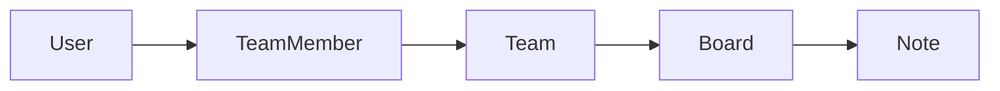

# Памятка к задаче 2: зачем нужны RBAC и изоляция данных

> [!tip] В двух словах
> **Минимальные полномочия.** Пользователь видит только свой tenant и выполняет только действия, разрешённые его ролью.

Эта памятка объясняет ход работы на упрощённом примере `Team -> Board -> Note`. Это не готовая реализация для Workspace Docs Starter: названия сущностей, набор действий и детали запросов намеренно отличаются.

## Контекст учебного примера

Сервис командных досок хранит заметки внутри доски, а доски — внутри команды. Доступ определяется записью `TeamMember` и ролью `LEAD`, `EDITOR` или `READER`.



## Ключевые термины

- **Authentication** подтверждает, кто отправил запрос; в примере это делает JWT guard.
- **Authorization** определяет, разрешено ли найденному пользователю выполнить действие.
- **RBAC** — модель, в которой разрешения зависят от роли пользователя.
- **Tenant** — изолированная область данных одного клиента или команды; здесь это `Team`.
- **Membership** — запись, связывающая пользователя, tenant и роль.
- **Policy** — общий компонент с правилами доступа, который не выполняет business operation.
- **Scope** — граница, внутри которой действует membership или разрешение.
- **Ownership** — дополнительное правило, зависящее от автора конкретной записи, а не только от роли.
- **Relation path** — цепочка связей от ресурса до tenant, например `Note -> Board -> Team`.
- **Outsider** — аутентифицированный пользователь без membership в проверяемом tenant.

## 1. Сначала разделяют authentication и authorization

JWT guard подтверждает личность и кладёт идентификатор пользователя в request. Он не отвечает на вопрос, разрешено ли пользователю удалить конкретную запись.

Типичный запрос проходит несколько проверок:

```text
JWT валиден?
  -> ресурс существует?
  -> пользователь состоит в его team?
  -> роль разрешает действие?
  -> выполнить бизнес-операцию
```

Если смешать эти проверки в каждом CRUD-методе, правила быстро начинают отличаться друг от друга.

> [!note] Аналогия для frontend
>
> - **React:** скрытие кнопки через компонент вроде `<Can action="update" />` улучшает UI, но не защищает API.
> - **Vue:** проверка роли в `v-if` или navigation guard улучшает UI, но не защищает API.
> - **Backend:** NestJS обязан заново проверить membership и роль, потому что endpoint можно вызвать без frontend.

## 2. Права описывают до написания guard

Пример для другой системы:

| Действие           | LEAD | EDITOR | READER |
| ------------------ | :--: | :----: | :----: |
| Читать board       |  ✅  |   ✅   |   ✅   |
| Создавать note     |  ✅  |   ✅   |   ❌   |
| Изменять note      |  ✅  |   ✅   |   ❌   |
| Архивировать board |  ✅  |   ❌   |   ❌   |
| Удалять board      |  ✅  |   ❌   |   ❌   |

Из таблицы удобно получить кодовую структуру:

```ts
const permissions = {
	viewBoard: ['LEAD', 'EDITOR', 'READER'],
	createNote: ['LEAD', 'EDITOR'],
	updateNote: ['LEAD', 'EDITOR'],
	archiveBoard: ['LEAD'],
	deleteBoard: ['LEAD'],
} as const;
```

Важно договориться, учитывается ли авторство записи. Чистый RBAC смотрит на роль. Условие «EDITOR редактирует только свои note» уже добавляет проверку ownership и должно быть явно записано отдельно.

## 3. Доступ к дочернему ресурсу проверяют по всей цепочке

У `Note` может не быть `teamId`, но есть `boardId`. Тогда team определяется так:

```text
Note -> Board -> Team -> TeamMember
```

Нельзя проверять только существование `Note` или наличие пользователя хотя бы в каком-нибудь team. Нужен membership именно в том team, которому принадлежит найденная note.

ORM-запрос для поиска контекста может концептуально выглядеть так:

```ts
const note = await prisma.note.findUnique({
	where: { id: noteId },
	include: {
		board: {
			select: { teamId: true },
		},
	},
});
```

После этого membership ищут по паре `(userId, teamId)`, а не только по `userId`.

## 4. Общий policy/service уменьшает расхождения

Для небольшого NestJS-проекта часто достаточно injectable policy-сервиса без сторонней библиотеки. Его публичный контракт может выглядеть примерно так:

```ts
await accessPolicy.requireTeamAction(userId, teamId, 'updateTeam');
await accessPolicy.requireBoardAction(userId, boardId, 'deleteBoard');
await accessPolicy.requireNoteAction(userId, noteId, 'updateNote');
```

Внутри него обычно находятся:

- загрузка resource context;
- поиск membership;
- таблица role -> actions;
- единое создание `NotFoundException` и `ForbiddenException`.

Feature-сервис после успешной проверки выполняет свою операцию. Он не должен заново интерпретировать роли.

Guard удобен, когда параметры доступа легко получить до вызова handler. Policy-сервис удобнее, когда сначала нужно пройти relation path через базу. В небольшом проекте допустимо сочетать JWT guard с policy-сервисом в feature service.

Если policy нужен нескольким feature-модулям, Nest должен создать его через dependency injection. Модуль-владелец экспортирует provider, а потребители импортируют модуль:

```ts
@Module({
	providers: [AccessPolicyService],
	exports: [AccessPolicyService],
})
export class AccessModule {}

@Module({
	imports: [AccessModule],
	controllers: [NotesController],
	providers: [NotesService],
})
export class NotesModule {}
```

Тогда `NotesService` получает policy через constructor, а не создаёт его вручную:

```ts
@Injectable()
export class NotesService {
	constructor(
		private readonly prisma: PrismaService,
		private readonly accessPolicy: AccessPolicyService,
	) {}
}
```

## 5. Порядок проверок определяет 403 или 404

При политике сокрытия существования обычно используют такой порядок:

1. Найти ресурс. Если его нет — `404`.
2. Определить его parent scope.
3. Найти membership пользователя именно в этом scope. Если membership нет — `404`.
4. Проверить действие для роли. Если роль не подходит — `403`.

Так outsider не узнает, существует ли чужая запись. При этом участник видит честный `403` и понимает, что ему не хватает прав.

Списки работают иначе: они не должны возвращать ошибку за каждую недоступную строку. Запрос сразу ограничивают доступным scope:

```ts
where: {
	board: {
		team: {
			members: { some: { userId } },
		},
	},
}
```

List должен сразу исключать чужие IDs, а не возвращать общий набор с последующей фильтрацией в JavaScript.

## 6. Идентификаторам из body нельзя безусловно доверять

Предположим, URL выглядит как `POST /boards/:boardId/notes`. Тогда `boardId` новой note должен браться из URL после проверки доступа. `authorId` должен браться из JWT. Если скопировать весь body через spread, клиент сможет попытаться подменить оба значения.

Безопасная идея:

```ts
data: {
	title: dto.title,
	content: dto.content,
	boardId,
	authorId: userId,
}
```

DTO должен перечислять редактируемые клиентом поля. Relation IDs и служебные поля в него обычно не включают.

## 7. Переиспользуемый каркас policy

Для любого tenant-проекта можно отделить загрузку scope от проверки permission:

```ts
type Role = 'LEAD' | 'EDITOR' | 'READER';
type Action = 'view' | 'create' | 'update' | 'archive' | 'delete';

const permissions: Record<Action, readonly Role[]> = {
	view: ['LEAD', 'EDITOR', 'READER'],
	create: ['LEAD', 'EDITOR'],
	update: ['LEAD', 'EDITOR'],
	archive: ['LEAD'],
	delete: ['LEAD'],
};

function assertAllowed(role: Role, action: Action): void {
	if (!permissions[action].includes(role)) throw new ForbiddenException();
}
```

```ts
async requireNote(userId: string, noteId: string, action: Action) {
	const note = await prisma.note.findUnique({
		where: { id: noteId },
		include: { board: { select: { teamId: true } } },
	});
	if (!note) throw new NotFoundException();

	const member = await prisma.teamMember.findUnique({
		where: { userId_teamId: { userId, teamId: note.board.teamId } },
	});
	if (!member) throw new NotFoundException();

	assertAllowed(member.role, action);
	return note;
}
```

Для list не загружайте всё и не фильтруйте JavaScript:

```ts
return prisma.note.findMany({
	where: { board: { team: { members: { some: { userId } } } } },
	select: { id: true, title: true, boardId: true },
});
```

## 8. Status меняют отдельным контрактом

Обычный update DTO не должен включать server-managed поля вроде `status`. При глобальном `ValidationPipe({ whitelist: true, forbidNonWhitelisted: true })` лишнее поле будет отклонено, а не незаметно передано в ORM:

```ts
export class UpdateBoardDto {
	@IsOptional()
	@IsString()
	name?: string;
}

@Patch(':boardId/archive')
archive(@Param('boardId') boardId: string, @CurrentUser() user: AuthUser) {
	return this.boardsService.archive(boardId, user.id);
}
```

Так `archive` получает собственную permission-проверку и не превращается в скрытую возможность любого `PATCH`.

## 9. Аддитивное поле статуса добавляют миграцией

Для нового enum и колонки сначала меняют Prisma schema, затем создают обычную migration:

```prisma
enum BoardStatus {
  ACTIVE
  ARCHIVED
}

model Board {
  id     String      @id @default(uuid())
  status BoardStatus @default(ACTIVE)
}
```

```bash
npx prisma migrate dev --name add-board-status
npx prisma generate
```

Default сохраняет совместимость со старыми create-вызовами и существующими строками. Перед применением проверяют сгенерированный `migration.sql`; `prisma db push` не заменяет versioned migration.

## 10. Частые ошибки

- Искать membership через `findFirst({ where: { userId } })` без ID нужного scope.
- Считать, что фильтра в list достаточно, и забывать get/update/delete по ID.
- Возвращать `403` outsider и тем самым подтверждать существование чужого ID.
- Разрешать `PATCH` менять foreign keys, автора или создателя.
- Создавать один service вручную внутри другого вместо Nest dependency injection.
- Проверять роль только в controller, а затем вызывать service из другого места без проверки.
- Проверять policy только на успешном сценарии LEAD.
- Считать status `200` достаточным и не анализировать содержимое list.

## 11. Как подойти к незнакомому проекту

Перед реализацией полезно пройти короткий маршрут:

1. Найти enum ролей и relation-модели в Prisma schema.
2. Выписать все HTTP endpoints для защищаемых ресурсов.
3. Найти существующие membership-проверки и отметить дублирование.
4. Проверить, откуда берутся parent IDs при create и update.
5. Посмотреть seed: действительно ли в нём есть каждая роль и outsider.
6. Согласовать матрицу и `403/404` до изменения кода.
7. После реализации пройти каждый endpoint из списка и убедиться, что он не пропущен.

Главная мысль: RBAC — это не один guard, а одинаковая политика на всех путях чтения и изменения данных.
