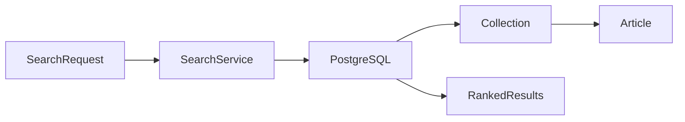

# Памятка к задаче 3: N+1, индексы и trigram search

> [!tip] В двух словах
> **Предсказуемая скорость.** Производительность улучшают по плану запроса и измерениям, а не количеством случайных индексов.

## Контекст учебного примера

В базе знаний организации `Article` находится в `Collection`. Пользователь ищет статьи с опечатками, а SQL обязан ограничить выдачу выбранной `Organization` до ranking и `LIMIT`.



## Ключевые термины

- **N+1** — один запрос получает N записей, после чего код делает ещё по запросу для каждой записи.
- **Индекс** — дополнительная структура PostgreSQL, ускоряющая подходящие чтения ценой места и более дорогих записей.
- **Query plan** — выбранный PostgreSQL способ прочитать таблицы, соединить строки и отсортировать результат.
- **Seq Scan** — последовательное чтение таблицы; для маленького или малоселективного набора оно может быть дешевле индекса.
- **Actual/estimated rows** показывают реальное и ожидаемое число строк, а **buffers** — объём страниц данных, затронутых запросом.
- **GIN/GiST** — типы индексов PostgreSQL; `pg_trgm` умеет использовать их для поиска похожих строк.
- **Ranking** — порядок результатов по релевантности, а **threshold** — минимальная допустимая похожесть.
- **Параметризованный SQL** отделяет текст запроса от значений и не позволяет пользовательскому вводу стать SQL-кодом.
- **Tie-break** — дополнительное поле сортировки, которое делает порядок одинаковых результатов стабильным.

## Что такое N+1

Приложение получает 100 заказов одним query, затем для каждого отдельно запрашивает автора: получается 101 обращение к БД. На локальных пяти строках это незаметно, а latency растёт линейно.

```text
плохо:  SELECT orders; for each order -> SELECT customer
лучше:  JOIN/include или второй SELECT customers WHERE id IN (...)
```

N+1 ищут по SQL-логам и числу запросов на один HTTP request. `include` не волшебство: нужно проверить, какой SQL реально создал ORM.

> [!note] Аналогия для frontend
>
> - **React:** `items.map(item => fetchDetails(item.id))` создаёт отдельный request для каждого элемента списка.
> - **Vue:** цикл по `ref(items)` с отдельным `fetchDetails` для каждого элемента создаёт ту же проблему.
> - **Backend:** Prisma-запрос внутри цикла делает такие же последовательные round trips, только между Node.js и PostgreSQL.

## Что показывает EXPLAIN ANALYZE

`EXPLAIN` описывает план, `ANALYZE` действительно выполняет запрос. Важны actual rows, loops, execution time, buffers и отличие estimate от факта.

- `Seq Scan` не всегда плох: для маленькой таблицы он дешевле индекса.
- Индекс ускоряет чтение, но занимает место и замедляет записи.
- Индекс полезен, когда соответствует filter/order/join конкретного запроса.

Измерение делают на объёме и распределении данных, похожем на реальное, несколько раз после прогрева.

## Как работает trigram

Строка разбивается на тройки символов. Чем больше общих троек, тем выше similarity. Поэтому поиск находит опечатки вроде `documnt` -> `document`.

```text
"hello" -> "  h", " he", "hel", "ell", "llo", "lo "
```

`pg_trgm` и GIN/GiST index ускоряют операторы similarity/LIKE, но ranking и threshold всё равно нужно определить контрактом. Короткие строки дают мало trigram и требуют отдельной валидации.

## Почему filter permissions должен быть в SQL

Если сначала выбрать top-20 по всей базе, а потом удалить чужие строки в JavaScript, пользователь получит пустой/искажённый top и сам запрос уже прочитает чужие candidates. Tenant filter должен участвовать в retrieval до `ORDER BY/LIMIT`.

## Безопасный raw SQL

Значения передают параметрами. Конкатенация `WHERE title LIKE '%${q}%'` создаёт SQL injection. Идентификаторы таблиц нельзя принимать от клиента вообще.

## Практический рецепт

Сначала измерьте число queries одного сценария. В Prisma можно временно слушать события:

```ts
const prisma = new PrismaClient({ log: [{ emit: 'event', level: 'query' }] });
let queryCount = 0;
prisma.$on('query', () => queryCount++);
```

Search DTO приводит query string к числам и ограничивает стоимость:

```ts
export class SearchQueryDto {
	@IsString()
	@Length(2, 100)
	q!: string;

	@Type(() => Number)
	@IsInt()
	@Min(1)
	@Max(50)
	limit = 20;
}
```

Migration включает extension и индекс для учебной таблицы `Article`:

```bash
npx prisma migrate dev --create-only --name article-heading-trigram
# добавить SQL ниже в созданный migration.sql и проверить diff
npx prisma migrate dev
```

```sql
CREATE EXTENSION IF NOT EXISTS pg_trgm;

CREATE INDEX "Article_heading_trgm_idx"
ON "Article"
USING GIN ("heading" gin_trgm_ops);
```

Extension/index остаются частью versioned Prisma migration, даже если SQL написан вручную. Не запускайте этот DDL как несохранённую команду и не заменяйте migration через `prisma db push`. Уже применённый `migration.sql` не редактируют; исправление оформляют следующей migration.

До и после migration выполните один и тот же план:

```sql
EXPLAIN (ANALYZE, BUFFERS)
SELECT a."id", a."heading", similarity(a."heading", 'deploy guide') AS score
FROM "Article" a
JOIN "Collection" c ON c."id" = a."collectionId"
WHERE c."organizationId" = 'organization-demo'
  AND a."heading" % 'deploy guide'
ORDER BY score DESC, a."publishedAt" DESC, a."id" ASC
LIMIT 20;
```

Raw SQL передаёт значения параметрами и фильтрует tenant до limit:

```ts
await prisma.$queryRaw<Row[]>`
	SELECT a."id", a."heading", similarity(a."heading", ${phrase}) AS score
	FROM "Article" a
	JOIN "Collection" c ON c."id" = a."collectionId"
	WHERE c."organizationId" = ${organizationId} AND a."heading" % ${phrase}
	ORDER BY score DESC, a."id" ASC
	LIMIT ${limit}
`;
```

В отчёте храните SQL, объём данных, actual time/rows/buffers до и после. Без одинаковых условий сравнение бессмысленно.

## Частые ошибки

- «лечить» N+1 кешем;
- добавлять индекс без плана до/после;
- возвращать тяжёлое content в search card;
- нестабильная pagination без tie-break;
- оценивать ranking только на одном совпадении;
- забыть tenant filter в raw query.
