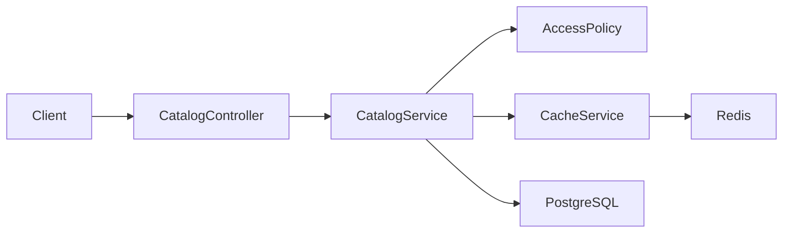

# Redis cache-aside: correctness, invalidation и stampede protection

> [!tip] В двух словах
> Cache ускоряет повторные reads, но создаёт вторую, временную копию данных. Без tenant-scoped keys, authorization перед hit и invalidation после commit он превращается из оптимизации в источник утечек и stale responses.

Этот guide — самостоятельный учебный материал. Он использует условный интернет-магазин:

```text
Store -> Category -> Product
```

PostgreSQL остаётся source of truth. Redis хранит готовые страницы каталога одного store с конкретными filters.



## 1. Что решает cache-aside

Без cache каждый одинаковый read повторяет работу PostgreSQL. Cache-aside оставляет управление приложению:

```text
READ  -> authorize -> cache hit -> response
READ  -> authorize -> cache miss -> DB -> cache SET -> response
WRITE -> authorize -> DB commit -> cache invalidate
```

Redis не становится источником истины. Если он недоступен, разрешённый запрос идёт в PostgreSQL: медленнее, но с тем же контрактом.

Cache-aside полезен, когда:

- одинаковые reads часто повторяются;
- query или response mapping заметно дороже Redis round trip;
- результат можно безопасно разделить между одинаковыми scopes;
- допустим ограниченный stale window;
- существует понятная invalidation strategy.

Не стоит кешировать редко повторяющиеся ответы, secrets, presigned URLs, огромные payloads, write responses как source of truth и permissions без отдельной модели их изменения.

## 2. Ключевые термины

- **Hit** — value найден и безопасно возвращён.
- **Miss** — value отсутствует, истёк или невалиден; нужен loader.
- **TTL** — срок жизни value.
- **Invalidation** — прекращение чтения value после изменения source of truth.
- **Stale data** — устаревшая cached copy.
- **Namespace** — префикс, отделяющий приложение, schema version и tenant.
- **Canonical parameters** — параметры в едином порядке и формате, из которых детерминированно строится key.
- **Cache stampede** — множество одновременных misses одного популярного key, одновременно нагружающих DB.
- **Distributed lock** — lock в общей системе, видимый всем backend instances.
- **Jitter** — bounded случайное изменение TTL, разносящее массовое expiry.
- **Degraded mode** — продолжение работы через DB при ошибке Redis.

## 3. Correctness и performance — разные доказательства

Correctness отвечает:

- тот ли tenant попал в key и DB query;
- проверена ли authorization до cache;
- совпадают ли hit/miss response shapes;
- исчезает ли старая version после write;
- сохраняются ли HTTP errors и degraded mode.

Performance отвечает:

- уменьшилось ли число DB loads;
- снизилась ли latency после warm-up;
- оправдывают ли hit rate и payload size сложность cache;
- не создают ли serialization, locks и Redis новый bottleneck.

Функциональный CI не должен утверждать `response < 50 ms`: shared runners и cold start нестабильны. Hit доказывают наблюдаемым key/TTL, controlled loader count или поведением собственного probe-fixture. Benchmark выполняют отдельно на фиксированном dataset, после warm-up и несколькими запусками.

## 4. Почему key — часть security model

Небезопасный key:

```text
catalog:list
```

Store A может прогреть его своим ответом, а Store B — получить чужие products. Минимальный key содержит:

1. application/schema namespace;
2. tenant ID;
3. invalidation version;
4. endpoint/response kind;
5. все parameters, меняющие response.

```text
shop:v1:store:{storeId}:v{version}:catalog:{paramsHash}
```

Если response зависит от actor или role, actor/permission variant также входит в key либо кешируется только общий payload до персонализации. Tenant key сам по себе не заменяет access check.

## 5. Canonical parameters

Эквивалентные inputs должны строить один key, разные responses — разные keys. После DTO transform/validation создайте object с фиксированным порядком:

```ts
const canonical = JSON.stringify({
  q: dto.q.trim(),
  categoryId: dto.categoryId ?? null,
  limit: dto.limit,
  offset: dto.offset,
});
```

Затем используйте hash:

```ts
import { createHash } from "node:crypto";

const paramsHash = createHash("sha256").update(canonical).digest("hex");
```

Hash ограничивает длину key и не раскрывает поисковую строку в key/log. Нельзя забывать pagination, sorting, locale или feature flag, если они меняют response.

Не нормализуйте параметр сильнее, чем бизнес-семантика endpoint. Например, lowercase допустим только если DB query гарантированно case-insensitive и score/order не меняются.

## 6. TTL и invalidation решают разные задачи

TTL:

- ограничивает максимальную жизнь забытых keys;
- очищает старые versions;
- страхует failure invalidation.

Invalidation:

- обеспечивает read-after-write в нормальном flow;
- немедленно переключает readers на новую version.

Большой TTL без invalidation показывает старые данные. Очень короткий TTL без invalidation превращает Redis в дорогой таймер и усиливает stampede.

Порядок write принципиален:

```text
правильно: DB commit -> invalidate
опасно:    invalidate -> DB commit
```

Во втором случае параллельный reader увидит miss, прочитает старую DB state, заполнит cache, после чего write завершится и оставит stale value.

## 7. Versioned namespace

Version key:

```text
shop:v1:store:{storeId}:version
```

Read:

```text
version = GET versionKey ?? 0
dataKey = shop:v1:store:{storeId}:v{version}:catalog:{paramsHash}
```

Write после commit:

```text
INCR shop:v1:store:{storeId}:version
```

Старые keys больше не читаются и исчезают по TTL. Не требуется перечислять их через `KEYS *` или global `SCAN`.

Важное свойство concurrency: reader может взять version N и начать DB load. Если mutation commit-ится и увеличивает version до N+1, старый reader всё равно запишет только key N. Новые requests читают N+1 и не увидят stale value.

Coarse-grained store version может инвалидировать больше данных, чем нужно. Это влияет на hit rate, но безопасно. Уточнять namespaces стоит только по измерениям, сохраняя атомарность invalidation каждой response dependency.

## 8. Базовый CacheModule

Redis client регистрируют один раз как Nest provider:

```ts
import { Inject, Injectable, Module, OnModuleDestroy } from "@nestjs/common";
import Redis from "ioredis";

export const REDIS = Symbol("REDIS");

@Injectable()
export class RedisLifecycle implements OnModuleDestroy {
  constructor(@Inject(REDIS) private readonly redis: Redis) {}

  async onModuleDestroy() {
    await this.redis.quit();
  }
}

@Module({
  providers: [
    {
      provide: REDIS,
      useFactory: () =>
        new Redis(process.env.REDIS_URL!, {
          maxRetriesPerRequest: 1,
          enableReadyCheck: true,
        }),
    },
    RedisLifecycle,
  ],
  exports: [REDIS],
})
export class CacheModule {}
```

В реальном проекте validation config выполняется до client creation, `CacheService` скрывает raw Redis API, а lifecycle provider и client не дублируются в feature modules.

```ts
function readCacheConfig(env: NodeJS.ProcessEnv) {
  const enabled = env.CACHE_ENABLED === "true";
  const ttlSeconds = Number(env.CACHE_TTL_SECONDS ?? "60");

  if (enabled && !env.REDIS_URL) throw new Error("REDIS_URL is required");
  if (!Number.isInteger(ttlSeconds) || ttlSeconds < 1) {
    throw new Error("CACHE_TTL_SECONDS must be a positive integer");
  }

  return { enabled, ttlSeconds };
}
```

## 9. Fail-open только для cache

Упрощённый read:

```ts
async getJson<T>(key: string): Promise<T | undefined> {
	try {
		const raw = await this.redis.get(key);
		if (raw === null) return undefined;
		return JSON.parse(raw) as T;
	} catch (error) {
		this.logger.warn({ key, error }, 'Cache read failed');
		return undefined;
	}
}
```

Fail-open относится только к Redis: cache error допускает DB fallback. Нельзя ловить `UnauthorizedException`, `NotFoundException`, `ForbiddenException`, DTO validation или PostgreSQL errors и выдавать их за cache miss.

Повреждённый JSON считается miss. Удаляется best-effort только exact key; частичный object клиенту не возвращается.

## 10. Cache stampede

При expiry сотни requests могут одновременно увидеть miss. Distributed lock разрешает одному owner пересчитать value:

```ts
const token = randomUUID();
const acquired = await redis.set(lockKey, token, "PX", 5000, "NX");
```

- `NX` создаёт lock только при отсутствии.
- `PX` ограничивает жизнь в milliseconds.
- token определяет владельца.

После захвата owner обязан повторно прочитать data key: другой request мог заполнить его между первым miss и lock acquisition.

Снимать lock обычным `DEL` нельзя. После expiry lock мог получить другой process. Нужен atomic compare-and-delete:

```lua
if redis.call('get', KEYS[1]) == ARGV[1] then
  return redis.call('del', KEYS[1])
end
return 0
```

## 11. Полный bounded algorithm

```ts
import { randomUUID } from "node:crypto";
import { setTimeout } from "node:timers/promises";

const RELEASE_LOCK = `
if redis.call('get', KEYS[1]) == ARGV[1] then
  return redis.call('del', KEYS[1])
end
return 0`;

async function getOrLoadWithLock<T>(
  redis: Redis,
  key: string,
  ttlSeconds: number,
  load: () => Promise<T>,
): Promise<T> {
  const tryRead = async () => {
    try {
      const raw = await redis.get(key);
      return raw === null ? undefined : (JSON.parse(raw) as T);
    } catch {
      return undefined;
    }
  };

  const hit = await tryRead();
  if (hit !== undefined) return hit;

  const lockKey = `${key}:lock`;
  const token = randomUUID();
  let acquired: string | null;

  try {
    acquired = await redis.set(lockKey, token, "PX", 5000, "NX");
  } catch {
    return load();
  }

  if (acquired === "OK") {
    try {
      const secondHit = await tryRead();
      if (secondHit !== undefined) return secondHit;

      const value = await load();
      try {
        const jitter = Math.floor(ttlSeconds * 0.1);
        const ttl =
          ttlSeconds - jitter + Math.floor(Math.random() * (jitter * 2 + 1));
        await redis.set(key, JSON.stringify(value), "EX", Math.max(1, ttl));
      } catch {
        // Source of truth already returned a value.
      }
      return value;
    } finally {
      try {
        await redis.eval(RELEASE_LOCK, 1, lockKey, token);
      } catch {
        // PX eventually releases the lock.
      }
    }
  }

  for (let attempt = 0; attempt < 3; attempt += 1) {
    await setTimeout(75 * (attempt + 1));
    const value = await tryRead();
    if (value !== undefined) return value;
  }

  return load();
}
```

Bounded fallback допускает несколько DB loads при долгом loader или Redis failure. Это безопаснее бесконечного ожидания. Если нужен строгий single-flight, lock renewal/fencing проектируют отдельно и доказывают для нескольких instances.

## 12. Authorization всегда раньше Redis

Небезопасно:

```text
GET cache -> hit -> return -> access check никогда не выполнен
```

Правильно:

```ts
async listCatalog(actorId: string, storeId: string, dto: CatalogQueryDto) {
	await this.accessPolicy.requireStore(actorId, storeId, 'product', 'view');

	const version = await this.cache.getVersion(storeId);
	const key = this.cache.catalogKey(storeId, version, dto);

	return this.cache.remember(key, 60, () =>
		this.prisma.product.findMany({
			where: { category: { storeId } },
			// select/order/pagination define the public contract.
		}),
	);
}
```

Нужны оба ограничения:

1. Policy формирует HTTP semantics и проверяет membership/role.
2. DB query содержит tenant predicate и не строит глобальную выдачу.

Cache не исправляет небезопасный loader. Если loader сначала ранжирует все tenants, чужие данные уже участвуют в result selection до записи в tenant key.

## 13. Invalidation matrix

Все mutations, способные изменить cached response, bump-ят tenant version после успешного DB commit:

| Mutation                              | Зависимый cache                         |
| ------------------------------------- | --------------------------------------- |
| create/update/archive/delete product  | catalog/search текущего store           |
| create/update/archive/delete category | catalog/search текущего store           |
| изменение membership/role             | все actor-readable views текущего store |

Если business write состоит из нескольких DB operations, они выполняются в transaction; invalidation запускается после её успешного завершения. Redis и PostgreSQL не образуют общую ACID transaction. Если `INCR` после commit упал, write сохраняется, ошибка логируется, stale ограничен TTL. Production-требование guaranteed invalidation требует outbox/retry, а не притворной атомарности dual write.

## 14. Real integration tests

Для cache correctness mock Redis недостаточен. E2E поднимает реальный Nest app, Redis и PostgreSQL:

1. Создаёт unique users/tenants/resources только для suite.
2. Получает JWT через HTTP login.
3. Проверяет `401` без JWT до создания cache key.
4. Делает miss, проверяет response, exact key и положительный TTL.
5. Доказывает hit controlled изменением собственного DB probe без invalidation или real query counter.
6. Выполняет mutation через HTTP и проверяет version bump и свежий следующий read.
7. Проверяет read roles, outsider hidden `404`, foreign tenant fixture и отсутствие sensitive fields.
8. Останавливает Redis и повторяет разрешённый/запрещённый HTTP flow.
9. Удаляет только exact DB fixtures и точный test namespace.

Тест не зависит от обычного seed, не делает `deleteMany({})`, `KEYS *`, `FLUSHDB`, `FLUSHALL` и не удаляет общий Redis volume. Hit не доказывают latency.

Concurrency test отправляет несколько simultaneous requests на пустой key. Он проверяет один normal loader path или документированный bounded fallback и отсутствие deadlock; тест не должен требовать идеального single-flight после истечения lock.

## 15. Карта переноса на Workspace Docs

Guide остаётся самостоятельным, а перенос выполняется буквально:

| Учебный пример                 | Workspace Docs                                  |
| ------------------------------ | ----------------------------------------------- |
| Store                          | Workspace                                       |
| Category                       | Project                                         |
| Product                        | Document                                        |
| CatalogService.listCatalog     | `ProjectsService.listByWorkspace`               |
| Catalog search                 | `DocumentsService.search`                       |
| `GET /stores/:storeId/catalog` | `GET /workspaces/:workspaceId/projects`         |
| filtered catalog search        | `GET /workspaces/:workspaceId/documents/search` |
| store access policy            | `AccessPolicyService.requireWorkspace`          |
| product relation to store      | `Document -> Project -> workspaceId`            |
| store version key              | workspace version key                           |
| catalog params                 | search `q`, `limit`, `offset`                   |

Точная Workspace Docs key schema:

```text
wsdocs:v1:workspace:{workspaceId}:version
wsdocs:v1:workspace:{workspaceId}:v{version}:projects
wsdocs:v1:workspace:{workspaceId}:v{version}:search:{sha256(canonical q/limit/offset)}
```

Перенос инвариантов:

- `OWNER`, `MEMBER`, `VIEWER` проходят existing `view`; outsider получает hidden `404` до Redis;
- project list сохраняет `_count.documents` и `createdBy.name`;
- search сохраняет task3 SQL, tenant predicate, threshold, ranking, pagination и shape;
- `Document.content` не попадает в search value;
- project/document mutations bump-ят workspace version после DB success;
- task4 не добавляет membership routes, но будущая membership mutation обязана bump-нуть version;
- `GET /projects` не кешируется в task4, потому что охватывает несколько workspaces.

## 16. Запрещённые схемы

- global/non-tenant keys;
- access check после hit;
- key без version или без полного набора response parameters;
- cache loader с global query и application post-filter;
- invalidation до DB commit;
- `KEYS *`, `FLUSHDB`, `FLUSHALL` или global `SCAN` в request/test cleanup;
- простой stampede-prone `miss -> load` для hot endpoints;
- lock без TTL или release через обычный `DEL`;
- бессрочный retry wait;
- Redis error как `500` при рабочем PostgreSQL;
- cache permissions или sensitive payloads;
- latency assertion как доказательство hit.

## 17. Самопроверка

- [ ] Authorization выполняется до cache hit.
- [ ] Loader сам tenant-scoped.
- [ ] Key содержит namespace version, tenant, data version и все параметры.
- [ ] TTL дополняет, но не заменяет invalidation.
- [ ] Version увеличивается после commit.
- [ ] Stale loader остаётся в старой version.
- [ ] Lock использует `NX`, `PX`, unique token и Lua compare-and-delete.
- [ ] Wait bounded, Redis failure ведёт в DB.
- [ ] Hit/miss имеют одинаковый public shape.
- [ ] E2E использует real NestJS, Redis, PostgreSQL и собственные fixtures.
- [ ] Correctness и performance проверяются разными методами.
- [ ] Карта переноса на Workspace Docs не требует догадок.
