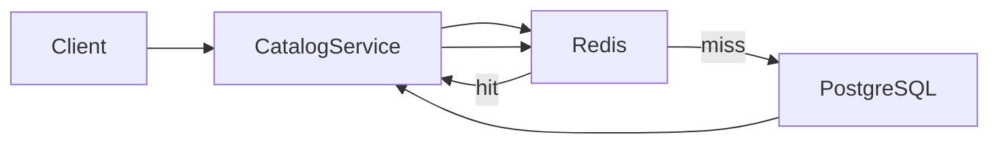

# Памятка к задаче 4: Redis cache-aside

> [!tip] В двух словах
> **Быстрые повторы.** Cache снимает повторную нагрузку с БД, но добавляет вторую копию данных, которую нужно безопасно обновлять.

## Контекст учебного примера

Интернет-магазин часто запрашивает один и тот же каталог товаров. PostgreSQL остаётся источником истины, а Redis временно хранит готовый ответ для конкретного магазина и набора filters.



## Ключевые термины

- **Cache-aside** — схема, в которой приложение само читает cache, загружает miss из БД и записывает результат обратно.
- **TTL** — время жизни cached value, после которого Redis автоматически удаляет key.
- **Invalidation** — принудительное прекращение использования cached value после изменения исходных данных.
- **Stale data** — устаревшие данные, которые ещё остаются в cache.
- **Cache stampede** — одновременный miss множества запросов по одному популярному key.
- **Distributed lock** — временная блокировка в общей системе, видимая всем экземплярам backend.
- **Jitter** — небольшое случайное изменение TTL, не позволяющее множеству keys истечь одновременно.
- **Namespace** — общий префикс keys, отделяющий приложение, tenant и версию формата cache.

## Cache-aside

Приложение само управляет кешем:

```text
GET -> cache hit -> response
GET -> cache miss -> DB -> cache SET -> response
WRITE -> DB commit -> cache invalidate
```

PostgreSQL остаётся source of truth. Если Redis недоступен, запрос идёт в DB: медленнее, но правильно.

> [!note] Аналогия для frontend
>
> - **React:** TanStack Query может временно хранить ответ для компонентов React и обновлять его после mutation.
> - **Vue:** Vue Query делает то же для компонентов Vue.
> - **Backend:** Redis находится вне одного browser/process и разделяется всеми экземплярами API, поэтому key обязан учитывать tenant и параметры запроса.

## Почему key — часть security model

Ключ `catalog:list` смешает ответы всех магазинов. Минимальный scope — store плюс все параметры, меняющие response. Если ответ зависит от пользователя или роли, эти признаки также входят в key либо кеширование происходит до персонализации.

Параметры нормализуют: `q= API ` и `q=api` должны давать один key. Длинные/чувствительные query удобно хешировать.

## TTL и invalidation решают разные проблемы

TTL ограничивает максимальное время stale data и убирает забытые keys. Invalidation обеспечивает read-after-write. Один большой TTL без invalidation показывает старые данные; очень короткий TTL превращает Redis в дорогой таймер.

Сначала commit БД, потом invalidate. Обратный порядок создаёт окно: cache очищен, параллельный reader загрузил старые данные, затем write завершился.

## Cache stampede

Когда популярный key истёк, сотни запросов одновременно идут в БД. Короткий distributed lock позволяет одному запросу пересчитать value. Lock обязан иметь expiry и token владельца; простой `DEL` может удалить уже чужой lock.

Jitter немного разносит expiry разных keys, чтобы они не протухали в одну секунду.

## Что кешировать не стоит

- редко повторяющиеся ответы;
- секреты и presigned URLs;
- permissions без продуманной invalidation;
- write response как источник истины;
- огромные objects, стоимость сериализации которых выше запроса.

## Переиспользуемый сервис

Локальный Redis можно поднять отдельным Compose service:

```yaml
redis:
  image: redis:7-bookworm
  command: ['redis-server', '--appendonly', 'yes']
  volumes:
    - redis-data:/data
  healthcheck:
    test: ['CMD', 'redis-cli', 'ping']
    interval: 5s
    timeout: 3s
    retries: 10
```

Клиент регистрируют один раз как Nest provider. Так feature-сервисы не открывают собственное соединение и его можно подменить в тесте:

```ts
import { Module } from '@nestjs/common';
import Redis from 'ioredis';

export const REDIS = Symbol('REDIS');

@Module({
	providers: [
		{
			provide: REDIS,
			useFactory: () => {
				const url = process.env.REDIS_URL;
				if (!url) throw new Error('REDIS_URL is required');
				return new Redis(url, {
					maxRetriesPerRequest: 1,
					enableReadyCheck: true,
				});
			},
		},
	],
	exports: [REDIS],
})
export class CacheModule {}
```

```ts
@Injectable()
export class CatalogCache {
	constructor(@Inject(REDIS) private readonly redis: Redis) {}
}
```

Остальные настройки тоже проверяют при bootstrap, до первого request:

```ts
function readCacheConfig(env: NodeJS.ProcessEnv) {
	const enabled = env.CACHE_ENABLED === 'true';
	const ttlSeconds = Number(env.CACHE_TTL_SECONDS ?? '60');
	if (enabled && !env.REDIS_URL) throw new Error('REDIS_URL is required when cache is enabled');
	if (!Number.isInteger(ttlSeconds) || ttlSeconds < 1) throw new Error('Invalid CACHE_TTL_SECONDS');
	return { enabled, ttlSeconds };
}
```

```ts
async getOrLoad<T>(key: string, ttlSeconds: number, load: () => Promise<T>): Promise<T> {
	try {
		const raw = await this.redis.get(key);
		if (raw !== null) return JSON.parse(raw) as T;
	} catch (error) {
		this.logger.warn({ error }, 'Cache read failed');
	}

	const value = await load();
	try {
		await this.redis.set(key, JSON.stringify(value), 'EX', ttlSeconds);
	} catch (error) {
		this.logger.warn({ error }, 'Cache write failed');
	}
	return value;
}
```

Версионный namespace упрощает invalidation:

```ts
const versionKey = `cache:store:${storeId}:version`;
const version = (await redis.get(versionKey)) ?? '0';
const listKey = `cache:store:${storeId}:v${version}:catalog:${filterHash}`;

// после DB commit
await redis.incr(versionKey);
```

Нормализованный search query можно превратить в короткий безопасный фрагмент key:

```ts
import { createHash } from 'node:crypto';

const normalizedQuery = query.trim().toLocaleLowerCase('ru-RU');
const filterHash = createHash('sha256').update(normalizedQuery).digest('hex');
```

Старые keys не читаются и удаляются TTL. Access check всё равно выполняется до `getOrLoad`.

Для stampede lock token должен сниматься atomically:

```ts
const token = randomUUID();
const acquired = await redis.set(lockKey, token, 'PX', 5000, 'NX');
if (acquired !== 'OK') return null;
```

`null` означает, что caller не владеет lock: он возвращается к короткому циклу чтения cache и только после ограниченного числа попыток загружает данные без lock. `PX` задаёт expiry в миллисекундах, а `NX` разрешает создать key только при его отсутствии. Снимать lock нужно через `EVAL` следующего Lua-скрипта: обычный `DEL` может удалить блокировку, которую после expiry уже получил другой процесс.

```lua
if redis.call('get', KEYS[1]) == ARGV[1] then
  return redis.call('del', KEYS[1])
end
return 0
```

Полный bounded retry не ждёт lock бесконечно и сохраняет деградацию в БД:

```ts
import { randomUUID } from 'node:crypto';
import { setTimeout } from 'node:timers/promises';

const RELEASE_LOCK = `
if redis.call('get', KEYS[1]) == ARGV[1] then
  return redis.call('del', KEYS[1])
end
return 0`;

async function getOrLoadWithLock<T>(
	redis: Redis,
	key: string,
	ttlSeconds: number,
	load: () => Promise<T>,
): Promise<T> {
	const tryRead = async () => {
		try {
			const raw = await redis.get(key);
			return raw === null ? undefined : (JSON.parse(raw) as T);
		} catch {
			return undefined;
		}
	};

	const hit = await tryRead();
	if (hit !== undefined) return hit;

	const lockKey = `${key}:lock`;
	const token = randomUUID();
	let acquired: string | null;
	try {
		acquired = await redis.set(lockKey, token, 'PX', 5000, 'NX');
	} catch {
		return load();
	}

	if (acquired === 'OK') {
		try {
			const secondHit = await tryRead();
			if (secondHit !== undefined) return secondHit;

			const value = await load();
			try {
				const ttlWithJitter = ttlSeconds + Math.floor(Math.random() * 10);
				await redis.set(key, JSON.stringify(value), 'EX', ttlWithJitter);
			} catch {
				// Value уже получен из source of truth, поэтому cache error не повторяет load.
			}
			return value;
		} finally {
			try {
				await redis.eval(RELEASE_LOCK, 1, lockKey, token);
			} catch {
				// Lock имеет PX и освободится сам, если Redis недоступен.
			}
		}
	}

	for (let attempt = 0; attempt < 3; attempt += 1) {
		await setTimeout(75 * (attempt + 1));
		const value = await tryRead();
		if (value !== undefined) return value;
	}

	return load();
}
```

Access policy вызывают **до** этой функции: даже корректный tenant key не заменяет authorization.

## Частые ошибки

- `KEYS *` в request path;
- один key для разных filters;
- access check после cache hit;
- ошибка Redis превращается в `500`;
- бессрочный lock;
- cache обновился, а DB transaction ещё не committed.
