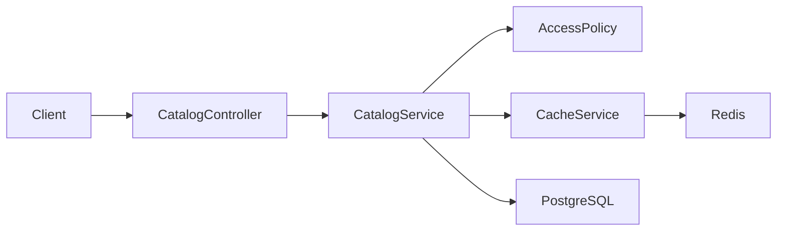

# Redis cache-aside: correctness, invalidation и stampede protection

> [!tip] В двух словах
> Cache ускоряет повторные reads, но создаёт вторую, временную копию данных. Без tenant-scoped keys, authorization перед hit и invalidation после commit он превращается из оптимизации в источник утечек и stale responses.

> [!note] Перед реализацией
> Посмотрите русскоязычный мини-курс [«Redis за 20 минут» — suchkov tech](https://www.youtube.com/watch?v=QpBaA6B1U90), опубликованный 25 февраля 2024 года. За 23 минуты автор объясняет назначение Redis, установку, базовые типы данных, TTL и показывает практическое кеширование с замерами до/после. На момент проверки у видео около 255 тысяч просмотров и 12 тысяч отметок «Нравится», то есть заметная положительная реакция аудитории. Ролик даёт необходимую базу, а tenant isolation, invalidation и stampede protection разбираются уже в этом guide.

Этот guide — самостоятельный учебный материал. Он использует условный интернет-магазин:

```text
Store -> Category -> Product
```

PostgreSQL остаётся source of truth. Redis хранит готовые страницы каталога одного store с конкретными filters.



## 1. Что решает cache-aside

### Зачем добавлять ещё одну систему рядом с PostgreSQL

PostgreSQL умеет хранить данные надёжно и выполнять сложные queries, но каждый request заставляет его повторять работу. Для каталога это может быть:

1. проверить tenant filter;
2. соединить products с categories и authors;
3. применить search operators и filters;
4. посчитать связанные записи;
5. отсортировать результат;
6. выделить нужную page;
7. передать rows приложению и собрать public response.

Даже оптимизированный query расходует CPU, читает index/table pages и занимает connection из database pool. Это оправдано, когда данные нужны впервые или изменились. Но если сто пользователей подряд запрашивают один каталог с одинаковыми параметрами, PostgreSQL сто раз формирует практически один ответ.

Redis нужен как быстрый временный слой перед PostgreSQL. Он хранит готовый результат по key преимущественно в памяти и возвращает его без повторного join, search, sorting и response mapping в основной базе.

```text
без Redis:
request 1 -> PostgreSQL вычисляет response
request 2 -> PostgreSQL снова вычисляет тот же response
request 3 -> PostgreSQL снова вычисляет тот же response

с Redis:
request 1 -> miss -> PostgreSQL вычисляет response -> Redis сохраняет копию
request 2 -> hit  -> Redis возвращает готовую копию
request 3 -> hit  -> Redis возвращает готовую копию
```

Таким образом Redis решает две практические задачи:

- сокращает время повторного read, если получение value из Redis дешевле исходного DB query;
- снимает повторную read-нагрузку с PostgreSQL и освобождает database connections для других запросов.

Redis не делает первый request быстрее: на miss приложение всё равно идёт в PostgreSQL и дополнительно записывает cache. Выигрыш появляется на следующих requests того же tenant с теми же параметрами до истечения TTL или invalidation.

### Почему не хранить cache в обычном `Map`

In-process `Map` работает только внутри одного Node.js process:

```text
backend instance A -> свой Map
backend instance B -> другой Map
worker             -> третий Map
```

При нескольких backend instances каждый process имеет собственные values и собственный момент invalidation. После restart локальный cache исчезает. Redis — отдельный общий service, поэтому все instances видят одни keys, locks и versions. Это особенно важно для distributed lock против stampede.

Для маленького single-process приложения локальный cache иногда достаточен. В этой задаче Redis выбран, чтобы изучить production-like shared cache и согласованное поведение нескольких экземпляров backend.

### Почему PostgreSQL всё равно остаётся главным

Redis хранит временную копию, а не единственное значение:

- mutation сначала записывается в PostgreSQL;
- cache можно полностью потерять и заново заполнить;
- при недоступном Redis разрешённый request продолжает работать через PostgreSQL;
- database constraints, transactions и migrations остаются в PostgreSQL;
- ответ из Redis разрешено использовать только после authentication и authorization.

Это отличает cache от source of truth. Потеря PostgreSQL означает потерю основных данных. Потеря Redis означает временно более медленные reads.

### Где здесь cache-aside

Cache-aside означает, что именно приложение решает, когда читать и заполнять cache. Redis сам не обращается к PostgreSQL и не знает, как построить catalog response:

```text
READ  -> authorize -> cache hit -> response
READ  -> authorize -> cache miss -> DB -> cache SET -> response
WRITE -> authorize -> DB commit -> cache invalidate
```

Redis не становится источником истины. Если он недоступен, разрешённый запрос идёт в PostgreSQL: медленнее, но с тем же контрактом.

### Когда Redis действительно полезен

Cache-aside имеет смысл, когда:

- одинаковые reads часто повторяются;
- query или response mapping заметно дороже Redis round trip;
- cached response не слишком велик;
- доля hits достаточна, чтобы компенсировать miss/serialization/invalidation;
- результат можно безопасно разделить между одинаковыми scopes;
- допустим ограниченный stale window;
- существует понятная invalidation strategy.

Redis не нужен «потому что так делают production-системы». Если query быстрый, requests почти не повторяются или данные меняются чаще, чем читаются, cache добавит network hop и сложность без заметной пользы. Решение подтверждают метриками: query cost, request frequency, hit rate, payload size и latency до/после.

Не стоит кешировать редко повторяющиеся ответы, secrets, presigned URLs, огромные payloads, write responses как source of truth и permissions без отдельной модели их изменения.

### Как это переносится на Workspace Docs

В проекте особенно подходят два повторяемых read-сценария:

- project list workspace включает relations и `_count.documents`;
- trigram document search выполняет tenant-scoped PostgreSQL search, ranking и pagination.

Первый разрешённый request формирует response из PostgreSQL. Следующий `OWNER`, `MEMBER` или `VIEWER` того же workspace с теми же параметрами может получить идентичный public response из Redis. Access policy при этом выполняется заново для каждого request. Точная карта переноса Store -> Workspace приведена в разделе 15.

## 2. Ключевые термины

- **Hit** — value найден и безопасно возвращён.
- **Miss** — value отсутствует, истёк или невалиден; нужен loader.
- **TTL** — срок жизни value.
- **Invalidation** — прекращение чтения value после изменения source of truth.
- **Stale data** — устаревшая cached copy.
- **Namespace** — префикс, отделяющий приложение, schema version и tenant.
- **Canonical parameters** — параметры в едином порядке и формате, из которых детерминированно строится key.
- **Cache stampede** — множество одновременных misses одного популярного key, одновременно нагружающих DB.
- **Distributed lock** — lock в общей системе, видимый всем backend instances.
- **Jitter** — bounded случайное изменение TTL, разносящее массовое expiry.
- **Degraded mode** — продолжение работы через DB при ошибке Redis.

## 3. Correctness и performance — разные доказательства

Correctness отвечает:

- тот ли tenant попал в key и DB query;
- проверена ли authorization до cache;
- совпадают ли hit/miss response shapes;
- исчезает ли старая version после write;
- сохраняются ли HTTP errors и degraded mode.

Performance отвечает:

- уменьшилось ли число DB loads;
- снизилась ли latency после warm-up;
- оправдывают ли hit rate и payload size сложность cache;
- не создают ли serialization, locks и Redis новый bottleneck.

Функциональный CI не должен утверждать `response < 50 ms`: shared runners и cold start нестабильны. Hit доказывают наблюдаемым key/TTL, controlled loader count или поведением собственного probe-fixture. Benchmark выполняют отдельно на фиксированном dataset, после warm-up и несколькими запусками.

Дальше разберём correctness по порядку. Сначала нужно гарантировать, что Redis ищет ответ именно для нужного tenant и нужного набора параметров. За это отвечают key и canonical parameters. Затем нужно решить, как перестать читать этот ответ после изменения PostgreSQL. За это отвечают TTL и invalidation.

## 4. Почему key — часть security model

Redis не понимает предметную область приложения. Он не знает, какой пользователь отправил request, к какому store относится product и прошёл ли actor access policy. Для Redis key — просто адрес, по которому лежит value:

```text
key -> cached response
```

Поэтому ошибка в key означает выбор неправильного ответа ещё до обращения к PostgreSQL. Представим два разрешённых запроса:

```http
GET /stores/store-a/catalog
GET /stores/store-b/catalog
```

Если оба используют один key:

```text
catalog:list
```

происходит следующая последовательность:

```text
1. Store A: miss -> PostgreSQL -> Redis SET catalog:list = products A
2. Store B: hit  -> Redis возвращает products A
```

Access policy для Store B могла успешно выполниться, но это не исправляет глобальный key: пользователь авторизован для Store B, а cache адресует ответ Store A. Поэтому tenant ID — обязательная часть key:

```text
shop:v1:store:store-a:catalog
shop:v1:store:store-b:catalog
```

Полный production key должен отвечать на вопрос: «Для какого приложения, формата ответа, tenant, версии данных и варианта request сохранён этот value?» Поэтому он содержит:

1. application/schema namespace;
2. tenant ID;
3. invalidation version;
4. endpoint/response kind;
5. все parameters, меняющие response.

```text
shop:v1:store:{storeId}:v{version}:catalog:{paramsHash}
```

Здесь части имеют разные обязанности:

- `shop:v1` отделяет приложение и версию public response schema;
- `store:{storeId}` не позволяет смешать tenants;
- `v{version}` перестаёт адресовать старые данные после mutation;
- `catalog` отделяет один вид response от другого;
- `{paramsHash}` различает filters и pages одного endpoint.

Key дополняет, но не заменяет authorization. Правильный порядок остаётся таким:

```text
JWT -> access policy -> tenant-scoped key -> cache/DB
```

Если response зависит от конкретного actor или role, этот вариант также входит в key либо cache хранит только общий payload до персонализации. В нашем учебном catalog response одинаков для всех ролей с permission `view`, поэтому достаточно store scope после обязательной policy-проверки.

## 5. Почему параметры request тоже входят в key

Tenant scope решает только первую половину задачи. Один store может запросить разные варианты каталога:

```http
GET /stores/store-a/catalog?q=phone&limit=20&offset=0
GET /stores/store-a/catalog?q=laptop&limit=20&offset=0
GET /stores/store-a/catalog?q=phone&limit=20&offset=20
```

Если key содержит только `store-a`, эти requests столкнутся по одному адресу, хотя PostgreSQL должен вернуть разные данные. Поэтому в key входят **все параметры, которые способны изменить response**: filters, sorting, pagination, locale и другие варианты контракта.

При этом строку query не стоит просто дописывать к key:

```text
q= phone
q=phone
limit отсутствует
limit=20
```

После DTO transform эти варианты могут означать одинаковый request. Если строить key из сырого URL, один логический ответ займёт несколько cache entries. Canonical parameters — это уже провалидированные значения, приведённые к одному представлению и записанные в фиксированном порядке:

```ts
const canonical = JSON.stringify({
  q: dto.q.trim(),
  categoryId: dto.categoryId ?? null,
  limit: dto.limit,
  offset: dto.offset,
});
```

Теперь действует простое правило:

```text
одинаковый DB response -> одинаковая canonical string
разный DB response      -> разная canonical string
```

Canonical string можно превратить в hash:

```ts
import { createHash } from "node:crypto";

const paramsHash = createHash("sha256").update(canonical).digest("hex");
```

Hash ограничивает длину key и не раскрывает поисковую строку в key/log. Он не исправляет забытый параметр: если `offset` не попал в canonical object, первая и вторая страницы всё равно получат один key.

Не нормализуйте параметр сильнее, чем бизнес-семантика endpoint. Например, lowercase допустим только если DB query гарантированно case-insensitive и score/order не меняются.

После разделов 4–5 Redis уже умеет выбрать value правильного tenant и правильного варианта request. Но этот value может устареть после `INSERT`, `UPDATE` или `DELETE`. Следующий раздел решает именно эту временную часть correctness.

## 6. TTL и invalidation решают разные задачи

Допустим, Store A запросил каталог, и Redis сохранил его на 60 секунд. Через пять секунд product переименовали в PostgreSQL. Key по-прежнему правильный: store и filters не изменились. Неправильным стало само cached value.

```text
t=00  GET catalog -> DB -> cache old product name
t=05  UPDATE product in DB
t=10  GET catalog -> cache still contains old product name
```

Здесь нужны два разных механизма.

**TTL** задаётся при `SET` и ограничивает, как долго Redis вообще может хранить value:

- ограничивает максимальную жизнь забытых keys;
- очищает старые versions;
- страхует failure invalidation.

**Invalidation** выполняется приложением после успешной mutation и прекращает использование текущей cached version сразу:

- обеспечивает read-after-write в нормальном flow;
- немедленно переключает readers на новую version.

TTL не заменяет invalidation: при TTL 60 секунд пользователь может видеть старое имя почти минуту. Invalidation не заменяет TTL: после смены version старые keys всё ещё занимают память, а при ошибке invalidation stale value мог бы жить бесконечно.

Поэтому механизмы работают вместе:

```text
TTL          -> ограничивает срок жизни и очищает старые keys
invalidation -> переключает requests на свежую version после write
```

Большой TTL без invalidation показывает старые данные. Очень короткий TTL без invalidation снижает hit rate, превращает Redis в дорогой таймер и усиливает stampede.

Порядок write принципиален. Invalidation выполняется только после успешного DB commit:

```text
правильно: DB commit -> invalidate
опасно:    invalidate -> DB commit
```

Во втором случае параллельный reader увидит miss, прочитает старую DB state, заполнит cache, после чего write завершится и оставит stale value.

Теперь все части складываются в одну схему:

```text
tenant scope + canonical parameters -> выбирают правильный cache address
TTL + invalidation                  -> не дают этому value использоваться слишком долго
```

Следующий раздел показывает практическую invalidation-схему, в которой для этого не нужно искать и удалять каждый data key.

## 7. Versioned namespace

Version key:

```text
shop:v1:store:{storeId}:version
```

Read:

```text
version = GET versionKey ?? 0
dataKey = shop:v1:store:{storeId}:v{version}:catalog:{paramsHash}
```

Write после commit:

```text
INCR shop:v1:store:{storeId}:version
```

Старые keys больше не читаются и исчезают по TTL. Не требуется перечислять их через `KEYS *` или global `SCAN`.

Важное свойство concurrency: reader может взять version N и начать DB load. Если mutation commit-ится и увеличивает version до N+1, старый reader всё равно запишет только key N. Новые requests читают N+1 и не увидят stale value.

Coarse-grained store version может инвалидировать больше данных, чем нужно. Это влияет на hit rate, но безопасно. Уточнять namespaces стоит только по измерениям, сохраняя атомарность invalidation каждой response dependency.

## 8. Базовый CacheModule

Учебный алгоритм ниже не обязан повторять весь production connection management. Но граница Nest module должна совпадать с архитектурой приложения: module владеет config, единственным Redis client и `CacheService`, а feature modules видят только `CacheService`.

```ts
import { Module } from "@nestjs/common";
import { ConfigService } from "@nestjs/config";
import Redis from "ioredis";
import { CacheService } from "./cache.service";
import { CACHE_CONFIG, CacheConfig, REDIS_CLIENT } from "./cache.tokens";

function positiveInteger(value: string | undefined, fallback: number, name: string) {
  const parsed = Number(value ?? fallback);
  if (!Number.isInteger(parsed) || parsed < 1) {
    throw new Error(`${name} must be a positive integer`);
  }
  return parsed;
}

function enabledValue(value: string | undefined) {
  if (value === undefined) return false;
  if (value === "true") return true;
  if (value === "false") return false;
  throw new Error("CACHE_ENABLED must be true or false");
}

@Module({
  providers: [
    {
      provide: CACHE_CONFIG,
      inject: [ConfigService],
      useFactory: (config: ConfigService): CacheConfig => ({
        enabled: enabledValue(config.get<string>("CACHE_ENABLED")),
        projectsTtlSeconds: positiveInteger(
          config.get<string>("CACHE_PROJECTS_TTL_SECONDS"),
          60,
          "CACHE_PROJECTS_TTL_SECONDS",
        ),
        searchTtlSeconds: positiveInteger(
          config.get<string>("CACHE_SEARCH_TTL_SECONDS"),
          30,
          "CACHE_SEARCH_TTL_SECONDS",
        ),
        lockTtlMs: positiveInteger(
          config.get<string>("CACHE_LOCK_TTL_MS"),
          5000,
          "CACHE_LOCK_TTL_MS",
        ),
      }),
    },
    {
      provide: REDIS_CLIENT,
      inject: [ConfigService, CACHE_CONFIG],
      useFactory: (config: ConfigService, cacheConfig: CacheConfig): Redis | null => {
        if (!cacheConfig.enabled) return null;

        // lazyConnect не делает Redis readiness условием старта backend.
        // Offline queue и автоматический retry отключены: fallback и повторное
        // подключение с cooldown координирует один CacheService.
        const url = config.get<string>("REDIS_URL");
        if (!url) throw new Error("REDIS_URL is required when cache is enabled");

        return new Redis(url, {
          lazyConnect: true,
          enableOfflineQueue: false,
          enableReadyCheck: true,
          maxRetriesPerRequest: 1,
          connectTimeout: 500,
          retryStrategy: () => null,
        });
      },
    },
    CacheService,
  ],
  exports: [CacheService],
})
export class CacheModule {}
```

`positiveInteger` отклоняет `NaN`, дроби, ноль и отрицательные значения. `enabledValue` не превращает произвольную непустую строку в `true`: допустимы только `true`, `false` и отсутствие настройки. URL проверяется только при включённом cache.

`CacheService` является единственным владельцем runtime lifecycle: он подписывается на Redis errors, держит общий `connectionPromise`, вводит cooldown после неудачи, а при shutdown пытается выполнить bounded `quit()` и при error/timeout вызывает `disconnect()`. Отдельного `RedisLifecycle` нет, поэтому два providers не конкурируют за один socket.

`REDIS_CLIENT` остаётся внутренней зависимостью module. `ProjectsService` и `DocumentsService` получают только `CacheService`; прямые команды Redis из feature services запрещены.

## 9. Fail-open только для cache

Проектный read различает обычный miss и недоступный Redis:

```ts
interface CacheRead<T> {
  available: boolean;
  hit: boolean;
  value?: T;
}

private async read<T>(key: string): Promise<CacheRead<T>> {
  // Connect failure означает unavailable, а не обычный cache miss.
  if (!(await this.ensureConnected())) return { available: false, hit: false };

  let raw: string | null | undefined;
  try {
    raw = await this.redis?.get(key);
  } catch (error) {
    // GET failure не доказывает, что value повреждён, поэтому key не удаляем.
    this.logFailure("GET", error);
    return { available: false, hit: false };
  }

  if (raw === null || raw === undefined) {
    return { available: true, hit: false };
  }

  try {
    return { available: true, hit: true, value: JSON.parse(raw) as T };
  } catch (error) {
    // Только реально полученный invalid JSON удаляется по exact key.
    this.logFailure("JSON parse", error);
    await this.deleteCorruptedKey(key);
    return { available: true, hit: false };
  }
}
```

`remember()` использует результат явно:

```ts
const firstRead = await this.read<T>(key);
if (firstRead.hit) return firstRead.value as T;
if (!firstRead.available) return load();
```

При `available=false` нет смысла создавать lock или ждать три retry: request сразу использует PostgreSQL. При `available=true, hit=false` Redis работает, поэтому можно координировать заполнение cache.

Fail-open относится только к Redis: cache error допускает DB fallback. Нельзя ловить `UnauthorizedException`, `NotFoundException`, `ForbiddenException`, DTO validation или PostgreSQL errors и выдавать их за cache miss.

Ошибка `GET` и ошибка декодирования — разные события. Первая только логируется и становится miss. Повреждённый JSON тоже считается miss, но дополнительно удаляется best-effort только exact key; ошибка этого `DEL` логируется и не превращается в HTTP `500`. Частичный object клиенту не возвращается, global cleanup не выполняется.

## 10. Cache stampede

### Lock простыми словами

Lock — это временная запись в Redis со смыслом:

```text
«Один request уже загружает данные для этого cache key.
Остальным пока не нужно делать тот же DB query».
```

Он нужен только в момент cache miss. Представим, что cache истёк и одновременно пришли 100 requests.

Без lock:

```text
100 requests увидели miss
-> все 100 пошли в PostgreSQL
-> PostgreSQL 100 раз выполняет один тяжёлый query
```

С lock:

```text
100 requests увидели miss
-> request A поставил lock и пошёл в PostgreSQL
-> остальные увидели lock и немного подождали
-> request A записал результат в cache
-> остальные прочитали один готовый результат из cache
```

То есть lock не хранит данные, не заменяет authorization и не блокирует весь Redis. Он временно координирует requests только вокруг одного конкретного cache key.

После заполнения cache request A освобождает lock — убирает табличку «работа выполняется», потому что работа уже закончена. TTL lock нужен лишь как аварийная страховка: если request A упадёт и не сможет убрать запись сам, Redis удалит её автоматически.

При expiry сотни requests могут одновременно увидеть miss. Distributed lock разрешает одному owner пересчитать value:

```ts
const token = randomUUID();
const acquired = await redis.set(lockKey, token, "PX", 5000, "NX");
```

- `NX` создаёт lock только при отсутствии.
- `PX` ограничивает жизнь в milliseconds.
- token определяет владельца.

После захвата owner обязан повторно прочитать data key: другой request мог заполнить его между первым miss и lock acquisition.

Снимать lock обычным `DEL` нельзя. После expiry lock мог получить другой process. Нужен atomic compare-and-delete:

```lua
if redis.call('get', KEYS[1]) == ARGV[1] then
  return redis.call('del', KEYS[1])
end
return 0
```

## 11. Полный алгоритм с ограниченным ожиданием (bounded)

Слово **bounded** означает «ограниченный пределами». В этом примере request, который не получил lock, не ждёт его бесконечно: он делает ровно три повторные проверки cache с паузами `75`, `150` и `225` ms. Максимальное ожидание чужого loader составляет примерно `450 ms`, не считая времени самих Redis-команд. Если value так и не появился, request самостоятельно вызывает `load()` и получает данные из PostgreSQL.

Ограничения нужны по двум причинам:

- зависший или медленный lock owner не удерживает остальные requests бесконечно;
- временная ошибка Redis не превращает доступность cache в обязательное условие работы endpoint.

Цена такого решения — после исчерпания ожидания несколько requests могут одновременно выполнить `load()`. Это осознанный компромисс: доступность важнее абсолютной гарантии единственного DB query.

Термин относится именно к ожиданию чужого lock, а не ко времени выполнения всей функции. Продолжительность `load()` ограничивается отдельными timeout-настройками PostgreSQL/Prisma и в данном примере не рассматривается.

Ниже основной flow собран как метод `CacheService`. Детали чтения, записи, подключения и Lua release вынесены в private helpers, поэтому orchestration остаётся видимой целиком.

```ts
import { randomUUID } from "node:crypto";
import { setTimeout as delay } from "node:timers/promises";

class CacheService {
  // Constructor, config и private helpers показаны в соседних разделах.
  async remember<T>(
    key: string,
    ttlSeconds: number,
    load: () => Promise<T>,
  ): Promise<T> {
    // Disabled cache не создаёт Redis client и сразу сохраняет прежний DB path.
    if (!this.config.enabled || !this.redis) return load();

    // Обычный hit возвращаем сразу. При недоступном Redis не ждём lock/retries.
    const firstRead = await this.read<T>(key);
    if (firstRead.hit) return firstRead.value as T;
    if (!firstRead.available) return load();

    // На настоящем miss пытаемся стать единственным DB loader этого data key.
    const lockKey = `${key}:lock`;
    const token = randomUUID();
    let acquired: string | null;

    try {
      acquired = await this.redis.set(
        lockKey,
        token,
        "PX",
        this.config.lockTtlMs,
        "NX",
      );
    } catch (error) {
      this.logFailure("lock acquisition", error);
      return load();
    }

    if (acquired === "OK") {
      try {
        // Пока мы получали lock, другой owner мог уже заполнить cache.
        const secondRead = await this.read<T>(key);
        if (secondRead.hit) return secondRead.value as T;

        // Только owner выполняет DB loader и best-effort write с jitter.
        const value = await load();
        await this.write(key, value, ttlSeconds);
        return value;
      } finally {
        // Helper делает token-safe Lua release; при Redis failure спасает lock TTL.
        await this.releaseLock(lockKey, token);
      }
    }

    // Не-владелец ограниченно ждёт owner. Unavailable Redis ведёт прямо в DB.
    for (const delayMs of [75, 150, 225]) {
      await delay(delayMs);
      const retry = await this.read<T>(key);
      if (retry.hit) return retry.value as T;
      if (!retry.available) return load();
    }

    // Owner не успел: доступность важнее строгого single-flight.
    return load();
  }
}
```

Последовательность для трёх одновременных requests выглядит так:

```text
request A -> miss -> получил lock -> PostgreSQL -> cache SET -> unlock -> response
request B -> miss -> lock занят -> wait -> cache hit -----------------> response
request C -> miss -> lock занят -> wait -> cache hit -----------------> response
```

Если `request A` работает дольше ограниченного ожидания:

```text
request A -> lock owner -> PostgreSQL всё ещё работает...
request B -> 75 ms -> miss -> 150 ms -> miss -> 225 ms -> miss -> свой DB load
```

Поэтому bounded fallback снижает stampede в нормальном случае, но допускает несколько DB loads при долгом loader или Redis failure. Он не является строгим `single-flight`. Если проекту нужна гарантия единственного loader, потребуются lock renewal, fencing tokens и отдельное доказательство корректности для нескольких instances.

### Как этот алгоритм устроен в Workspace Docs

- Показанный `remember()` повторяет orchestration одноимённого метода `CacheService`; в проекте три задержки вычисляются как эквивалентные 75, 150 и 225 ms.
- `CacheService.read()` возвращает отдельные флаги `available` и `hit`, как показано в разделе 9. Поэтому Redis failure не маскируется под обычное отсутствие key.
- Cache `SET` вынесен в `CacheService.write()`, где фактический TTL получает bounded jitter ±10%.
- Compare-and-delete script выполняет `CacheService.releaseLock()`.
- Проверка доступности и единое подключение находятся в `CacheService.ensureConnected()`: `lazyConnect`, общий `connectionPromise` и cooldown не допускают reconnect storm.
- `CacheService.logFailure()` throttles одинаковую operation на время cooldown и пишет только тип/code ошибки, но не payload, raw query, credentials или cache key.
- Единственный `CacheService.onModuleDestroy()` пытается выполнить `quit()` не дольше 500 ms и использует `disconnect()` при error/timeout.
- Store version становится workspace version; при disabled/unavailable Redis `getWorkspaceVersion()` возвращает `null`, а feature service сразу вызывает DB loader. Отсутствующий version key при доступном Redis означает строку `"0"`.
- Catalog loader становится прежним `ProjectsService.listByWorkspace` loader или tenant-scoped `DocumentsService.search` loader.
- Повреждённый JSON удаляется только по exact data key; feature services не получают `REDIS_CLIENT`.

## 12. Authorization всегда раньше Redis

Небезопасно:

```text
GET cache -> hit -> return -> access check никогда не выполнен
```

Правильно:

```ts
async listCatalog(actorId: string, storeId: string, dto: CatalogQueryDto) {
	await this.accessPolicy.requireStore(actorId, storeId, 'product', 'view');

	const load = () =>
		this.prisma.product.findMany({
			where: { category: { storeId } },
			// select/order/pagination define the public contract.
		});

	const version = await this.cache.getStoreVersion(storeId);
	if (version === null) return load();

	const key = this.cache.catalogKey(storeId, version, dto);
	return this.cache.remember(key, 60, load);
}
```

Нужны оба ограничения:

1. Policy формирует HTTP semantics и проверяет membership/role.
2. DB query содержит tenant predicate и не строит глобальную выдачу.

Cache не исправляет небезопасный loader. Если loader сначала ранжирует все tenants, чужие данные уже участвуют в result selection до записи в tenant key.

## 13. Invalidation matrix

Все mutations, способные изменить cached response, bump-ят tenant version после успешного DB commit:

| Mutation                              | Зависимый cache                         |
| ------------------------------------- | --------------------------------------- |
| create/update/archive/delete product  | catalog/search текущего store           |
| create/update/archive/delete category | catalog/search текущего store           |
| изменение membership/role             | все actor-readable views текущего store |

Если business write состоит из нескольких DB operations, они выполняются в transaction; invalidation запускается после её успешного завершения. Redis и PostgreSQL не образуют общую ACID transaction. Если `INCR` после commit упал, write сохраняется, ошибка логируется, stale ограничен TTL. Production-требование guaranteed invalidation требует outbox/retry, а не притворной атомарности dual write.

## 14. Real integration tests

Для cache correctness mock Redis недостаточен. E2E поднимает реальный Nest app, Redis и PostgreSQL. Providers остаются настоящими; точечный `jest.spyOn` используется только для наблюдения loader или воспроизведения конкретного error branch:

1. Создаёт unique users/tenants/resources только для suite.
2. Получает JWT через HTTP login.
3. Проверяет `401` без JWT до создания cache key.
4. Проверяет, что `CacheModule` экспортирует только `CacheService`.
5. Отличает Redis GET failure от invalid JSON: первый не удаляет key, второй удаляет только exact key и перезаполняется из PostgreSQL.
6. Доказывает различие keys по workspace, version, `q`, `limit` и `offset`, а также отсутствие raw query в key.
7. Проверяет положительный integer jitter в пределах ±10%.
8. Делает miss, проверяет response, exact key и положительный TTL.
9. Доказывает hit controlled изменением собственного DB probe без invalidation или real query counter.
10. Выполняет все project/document mutations через HTTP и проверяет version bump и свежий следующий read.
11. Проверяет, что mutation одного workspace не меняет version другого.
12. Проверяет OWNER/MEMBER/VIEWER, outsider hidden `404`, foreign tenant fixture и отсутствие sensitive fields.
13. Отдельным process при недоступном Redis проверяет один concurrent connection attempt, DB fallback, `401`, hidden `404` и tenant isolation.
14. Закрывает Nest app и проверяет graceful `quit()`, `disconnect()` fallback и отсутствие открытого Redis handle.
15. Удаляет только exact DB fixtures и точный test namespace.

Тест не зависит от обычного seed, не делает `deleteMany({})`, `KEYS *`, `FLUSHDB`, `FLUSHALL` и не удаляет общий Redis volume. Hit не доказывают latency.

Concurrency test отправляет несколько simultaneous requests на пустой key. Он проверяет один normal loader path или документированный bounded fallback и отсутствие deadlock; тест не должен требовать идеального single-flight после истечения lock.

## 15. Карта переноса на Workspace Docs

Guide остаётся самостоятельным, а перенос выполняется буквально:

| Учебный пример                 | Workspace Docs                                  |
| ------------------------------ | ----------------------------------------------- |
| Store                          | Workspace                                       |
| Category                       | Project                                         |
| Product                        | Document                                        |
| CatalogService.listCatalog     | `ProjectsService.listByWorkspace`               |
| Catalog search                 | `DocumentsService.search`                       |
| `GET /stores/:storeId/catalog` | `GET /workspaces/:workspaceId/projects`         |
| filtered catalog search        | `GET /workspaces/:workspaceId/documents/search` |
| store access policy            | `AccessPolicyService.requireWorkspace`          |
| product relation to store      | `Document -> Project -> workspaceId`            |
| store version key              | workspace version key                           |
| catalog params                 | search `q`, `limit`, `offset`                   |

Точная Workspace Docs key schema:

```text
wsdocs:v1:workspace:{workspaceId}:version
wsdocs:v1:workspace:{workspaceId}:v{version}:projects
wsdocs:v1:workspace:{workspaceId}:v{version}:search:{sha256(canonical q/limit/offset)}
```

Project list переносит алгоритм без скрытых шагов:

```ts
async listByWorkspace(userId: string, workspaceId: string) {
  await this.accessPolicy.requireWorkspace(userId, workspaceId, "view", "project");

  const load = () =>
    this.prisma.project.findMany({
      where: { workspaceId },
      // Существующие include и orderBy сохраняют public response shape.
    });

  const version = await this.cache.getWorkspaceVersion(workspaceId);
  if (version === null) return load();

  const key = this.cache.projectsKey(workspaceId, version);
  return this.cache.remember(key, this.cache.projectsTtlSeconds, load);
}
```

Search использует ту же оболочку, но строит key из canonical `q/limit/offset`, а `load` оставляет неизменными transaction-local thresholds, tenant-scoped trigram SQL, ranking, pagination и response mapping задачи №3.

Перенос инвариантов:

- `OWNER`, `MEMBER`, `VIEWER` проходят existing `view`; outsider получает hidden `404` до Redis;
- project list сохраняет `_count.documents` и `createdBy.name`;
- search сохраняет task3 SQL, tenant predicate, threshold, ranking, pagination и shape;
- `Document.content` не попадает в search value;
- project/document mutations bump-ят workspace version после DB success;
- task4 не добавляет membership routes, но будущая membership mutation обязана bump-нуть version;
- `GET /projects` не кешируется в task4, потому что охватывает несколько workspaces.

## 16. Запрещённые схемы

- global/non-tenant keys;
- access check после hit;
- key без version или без полного набора response parameters;
- cache loader с global query и application post-filter;
- invalidation до DB commit;
- `KEYS *`, `FLUSHDB`, `FLUSHALL` или global `SCAN` в request/test cleanup;
- простой stampede-prone `miss -> load` для hot endpoints;
- lock без TTL или release через обычный `DEL`;
- бессрочный retry wait;
- Redis error как `500` при рабочем PostgreSQL;
- cache permissions или sensitive payloads;
- latency assertion как доказательство hit.

## 17. Самопроверка

- [ ] Authorization выполняется до cache hit.
- [ ] Loader сам tenant-scoped.
- [ ] Key содержит namespace version, tenant, data version и все параметры.
- [ ] TTL дополняет, но не заменяет invalidation.
- [ ] Version увеличивается после commit.
- [ ] Stale loader остаётся в старой version.
- [ ] Lock использует `NX`, `PX`, unique token и Lua compare-and-delete.
- [ ] Wait bounded, Redis failure ведёт в DB.
- [ ] Обычный miss отличается от недоступного Redis через `available`/`hit`.
- [ ] Invalid JSON удаляет exact key, а GET failure ничего не удаляет.
- [ ] Feature modules получают `CacheService`, но не raw Redis client.
- [ ] Connection cooldown, throttled logs и bounded shutdown описаны так же, как в Workspace Docs.
- [ ] Hit/miss имеют одинаковый public shape.
- [ ] E2E использует real NestJS, Redis, PostgreSQL и собственные fixtures.
- [ ] Correctness и performance проверяются разными методами.
- [ ] Карта переноса на Workspace Docs не требует догадок.

## 18. Материалы для дальнейшего изучения

### Официальная документация

- [Redis: cache-aside](https://redis.io/docs/latest/develop/use-cases/cache-aside/) — полный flow cache hit/miss, TTL, invalidation и защита от stampede. Основной источник, уровень: средний.
- [Redis: cache-aside с Node.js](https://redis.io/docs/latest/develop/use-cases/cache-aside/nodejs/) — исполняемый пример для Node.js, включая namespace keys, bounded staleness и single-flight lock. Практический источник, уровень: средний.
- [Redis: команда SET](https://redis.io/docs/latest/commands/set/) — точная семантика `NX`, `EX` и `PX`, используемых для value и lock. Справочник, уровень: начальный–средний.
- [Redis: distributed locks](https://redis.io/docs/latest/develop/clients/patterns/distributed-locks/) — safety/liveness guarantees, unique token, expiry и корректное освобождение lock. Углублённый источник, уровень: продвинутый.
- [ioredis](https://github.com/redis/ioredis) — официальный репозиторий используемого Node.js client: подключение, retries, events, transactions и Lua scripts. Справочник по библиотеке, уровень: средний.

### Русскоязычный вводный материал

- [Redis за 20 минут — suchkov tech](https://www.youtube.com/watch?v=QpBaA6B1U90) — видео 2024 года: назначение Redis, установка, strings/lists/hashes, TTL и практический пример кеширования с замерами производительности. Рекомендуется посмотреть до раздела 1, уровень: начальный.
