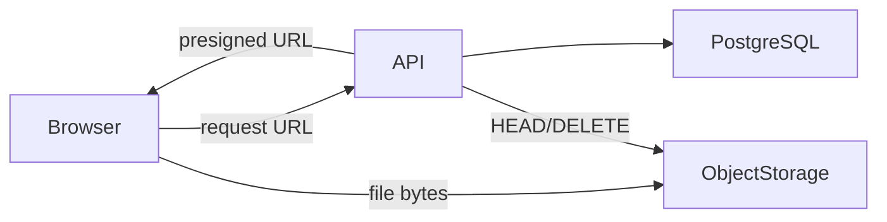

# Памятка к задаче 5: object storage, presigned URLs и streams

> [!tip] В двух словах
> **Большие данные отдельно.** База хранит связи и metadata, object storage — bytes, а stream не даёт большому файлу занять всю память процесса.

## Контекст учебного примера

Медиатека хранит `Asset` внутри `Album`. API проверяет право, создаёт metadata и выдаёт временную ссылку, а browser загружает bytes напрямую в S3-compatible storage.



## Ключевые термины

- **Object storage** — хранилище, где файл доступен по bucket и object key, а не по пути на диске backend.
- **Bucket** — верхнеуровневый контейнер объектов в S3/MinIO.
- **Object key** — строковый идентификатор объекта внутри bucket.
- **Presigned URL** — временно подписанный URL для одной разрешённой операции с object.
- **Stream** — чтение или запись данных последовательными порциями без загрузки всего файла в память.
- **Backpressure** — пауза producer, когда consumer или network не успевает принимать новые данные.
- **MIME type** — объявленный формат содержимого файла, который нельзя безусловно принимать от клиента.
- **Orphan object** — object в storage, для которого больше нет актуальной записи в БД.
- **CDN** — географически распределённый слой раздачи готовых assets, обычно полезный для публичных или отдельно подписанных файлов.

## Почему файл не кладут в PostgreSQL/API process

Большие binary rows раздувают backup/WAL и конкурируют с обычными запросами. Проксирование каждой загрузки через backend тратит его network/memory. Типичная схема:

```text
client -> API: request permission
API -> client: short presigned PUT URL
client -> S3: upload bytes
client -> API: complete
API -> S3: HEAD and verify
```

Presigned URL — временное полномочие выполнить одну операцию над одним object. Поэтому bucket остаётся private.

> [!note] Аналогия для frontend
>
> - **React:** компонент получает `File` из `<input>` и отправляет его напрямую по presigned URL, не прокладывая bytes через React state.
> - **Vue:** компонент получает тот же `File` через `@change` и отправляет его напрямую, не сохраняя bytes в reactive state.
> - **Backend:** API проверяет право и выдаёт URL, но большой file body проходит напрямую между browser и object storage.

## Зачем статус PENDING/READY

Metadata может создаться, а upload — не завершиться. Без статуса API будет показывать несуществующий файл. `complete` подтверждает размер/тип через storage и только потом делает файл доступным.

Удаление тоже распределённая операция: PostgreSQL и S3 не имеют общей транзакции. Промежуточный `DELETING` делает ошибку видимой и повторяемой.

## Object key не равен имени файла

Пользовательское имя может содержать `../`, Unicode tricks или совпасть с другим именем. Backend генерирует непрозрачный key, а original name хранит отдельно для интерфейса.

MIME от клиента нельзя считать доказанным. Его сверяют с allowlist, extension и, при необходимости, сигнатурой файла/антивирусной обработкой.

## Как stream ограничивает память

Без stream код сначала строит миллион строк в массиве и один огромный `Buffer`. Со stream очередная порция проходит дальше, а backpressure останавливает producer, если network/storage не успевает.

```text
DB cursor/page -> CSV transform -> HTTP response
```

Важны корректное CSV escaping, обработка disconnect и отсутствие неограниченного промежуточного массива.

## CDN и приватные файлы

CDN полезен для публичных immutable assets. Приватный документ нельзя сделать публичным только ради CDN. Для него используют signed CDN URL/cookie или по-прежнему signed S3 download после authorization.

## Переиспользуемый S3-рецепт

Для локальной разработки нужны само storage и одноразовая init-job, создающая private bucket:

```yaml
services:
  minio:
    image: minio/minio:latest
    command: server /data --console-address :9001
    environment:
      MINIO_ROOT_USER: ${S3_ACCESS_KEY}
      MINIO_ROOT_PASSWORD: ${S3_SECRET_KEY}
    volumes:
      - minio-data:/data
    ports:
      - '9000:9000'
      - '9001:9001'
    healthcheck:
      test: ['CMD', 'curl', '-f', 'http://localhost:9000/minio/health/live']
      interval: 5s
      timeout: 3s
      retries: 20

  minio-init:
    image: minio/mc:latest
    depends_on:
      minio:
        condition: service_healthy
    entrypoint: ['/bin/sh', '-c']
    command:
      - >-
        mc alias set local http://minio:9000 "$${S3_ACCESS_KEY}" "$${S3_SECRET_KEY}" &&
        mc mb --ignore-existing "local/$${S3_BUCKET}" &&
        mc anonymous set none "local/$${S3_BUCKET}"
    environment:
      S3_ACCESS_KEY: ${S3_ACCESS_KEY}
      S3_SECRET_KEY: ${S3_SECRET_KEY}
      S3_BUCKET: ${S3_BUCKET}
```

В реальном репозитории image tags фиксируют на проверенной версии. Init-job идемпотентна благодаря `--ignore-existing` и не публикует bucket.

Клиент под MinIO отличается от AWS endpoint и path-style адресацией. Его удобно экспортировать из storage-модуля:

```ts
function requiredEnv(name: string): string {
	const value = process.env[name];
	if (!value) throw new Error(`${name} is required`);
	return value;
}

export const S3_CLIENT = Symbol('S3_CLIENT');

@Module({
	providers: [
		{
			provide: S3_CLIENT,
			useFactory: () =>
				new S3Client({
					endpoint: requiredEnv('S3_ENDPOINT'),
					region: process.env.S3_REGION ?? 'us-east-1',
					forcePathStyle: true,
					credentials: {
						accessKeyId: requiredEnv('S3_ACCESS_KEY'),
						secretAccessKey: requiredEnv('S3_SECRET_KEY'),
					},
				}),
		},
		S3BlobStorage,
	],
	exports: [S3BlobStorage],
})
export class StorageModule {}
```

Feature code зависит от интерфейса, а не от AWS SDK напрямую:

```ts
export interface BlobStorage {
	createPutUrl(input: { objectKey: string; mimeType: string; expiresIn: number }): Promise<string>;
	createGetUrl(input: {
		objectKey: string;
		downloadName: string;
		expiresIn: number;
	}): Promise<string>;
	inspect(objectKey: string): Promise<{ size: number; etag?: string }>;
	delete(objectKey: string): Promise<void>;
}
```

Ключ строит server из проверенного контекста:

```ts
const objectKey = `libraries/${libraryId}/albums/${albumId}/assets/${randomUUID()}`;
```

Имя и MIME проверяют до создания metadata. Имя не участвует в key:

```ts
import { extname } from 'node:path';

const extensionsByMime = new Map([
	['image/jpeg', new Set(['.jpg', '.jpeg'])],
	['image/png', new Set(['.png'])],
	['text/plain', new Set(['.txt'])],
]);

function normalizeUploadName(input: string, mimeType: string): string {
	const leaf = input.replace(/\\/g, '/').split('/').at(-1) ?? '';
	const safeName = leaf
		.normalize('NFKC')
		.replace(/[\u0000-\u001f]/g, '_')
		.trim();
	if (!safeName || safeName === '.' || safeName === '..') throw new BadRequestException();
	const extension = extname(safeName).toLowerCase();
	if (!extensionsByMime.get(mimeType)?.has(extension)) {
		throw new UnsupportedMediaTypeException();
	}
	return safeName.slice(0, 200);
}
```

```ts
async createUploadUrl(key: string, mimeType: string): Promise<string> {
	const command = new PutObjectCommand({
		Bucket: this.bucket,
		Key: key,
		ContentType: mimeType,
	});
	return getSignedUrl(this.s3, command, { expiresIn: 600 });
}

async verifyUpload(key: string, expectedSize: number) {
	const object = await this.s3.send(new HeadObjectCommand({ Bucket: this.bucket, Key: key }));
	if (object.ContentLength !== expectedSize) throw new UnprocessableEntityException();
}
```

Потоковый export можно построить через async generator:

```ts
async function* readRows(prisma: PrismaClient, libraryId: string) {
	let cursor: string | undefined;
	while (true) {
		const rows = await prisma.asset.findMany({
			where: { album: { libraryId } },
			select: {
				id: true,
				albumId: true,
				originalName: true,
				mimeType: true,
				owner: { select: { displayName: true } },
				updatedAt: true,
			},
			take: 500,
			...(cursor ? { cursor: { id: cursor }, skip: 1 } : {}),
			orderBy: { id: 'asc' },
		});
		if (rows.length === 0) return;
		yield* rows;
		cursor = rows.at(-1)!.id;
	}
}
```

Controller пишет строки по мере чтения и ждёт `drain` только тогда, когда `response.write()` вернул `false`:

```ts
import { once } from 'node:events';

function toCsvLine(values: Array<string | number>): string {
	const escaped = values.map((value) => {
		const text = String(value);
		const quoted = text.replace(/"/g, '""');
		return /[",\r\n]/.test(text) ? `"${quoted}"` : quoted;
	});
	return `${escaped.join(',')}\n`;
}

@Get(':libraryId/assets.csv')
async exportAssets(
	@Param('libraryId') libraryId: string,
	@Req() request: Request,
	@Res() response: Response,
): Promise<void> {
	await this.accessPolicy.requireLibraryAction(request.user.id, libraryId, 'view');

	response.status(200);
	response.setHeader('content-type', 'text/csv; charset=utf-8');
	response.setHeader('content-disposition', 'attachment; filename="assets.csv"');
	response.write('id,albumId,name,mimeType,ownerName,updatedAt\n');

	let aborted = false;
	request.on('aborted', () => {
		aborted = true;
	});
	response.on('close', () => {
		if (response.writableEnded) return;
		aborted = true;
	});

	for await (const row of readRows(this.prisma, libraryId)) {
		if (aborted || request.destroyed) break;
		const line = toCsvLine([
			row.id,
			row.albumId,
			row.originalName,
			row.mimeType,
			row.owner.displayName,
			row.updatedAt.toISOString(),
		]);
		if (!response.write(line)) {
			// Продолжение без drain снова начнёт накапливать CSV в памяти.
			await Promise.race([once(response, 'drain'), once(response, 'close')]);
		}
	}

	if (!aborted) response.end();
}
```

`@Res()` здесь намеренно используется без `passthrough`: Nest не сериализует return value и не пытается отправить второй response.

## Частые ошибки

- хранить presigned URL в БД как постоянный;
- доверять object key из body;
- выдать URL до RBAC;
- считать metadata созданного upload готовым файлом;
- забыть orphan cleanup;
- назвать streaming endpoint потоковым, но заранее вызвать `findMany` без limit.
