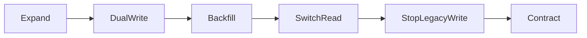

# Памятка к задаче 7: zero-downtime migrations

> [!tip] В двух словах
> **Совместимость версий.** Во время rollout старый и новый код работают одновременно, поэтому схема должна временно поддерживать оба.

## Контекст учебного примера

Платформа публикаций переносит текст `Article` из legacy-колонки `rawText` в новую `bodyText`. Во время rollout одновременно работают старая и новая версии API.



## Ключевые термины

- **Rollout** — постепенный выпуск новой версии, во время которого старые и новые instances работают одновременно.
- **Expand** добавляет совместимую схему, не удаляя старые поля.
- **Dual-write** временно записывает одно значение в старое и новое представление.
- **Backfill** заполняет новое представление для ранее сохранённых строк.
- **Switch** переводит чтение на новые данные.
- **Contract** удаляет устаревшую схему после завершения окна rollback.
- **Nullable field** временно разрешает `NULL`, поэтому старые строки остаются совместимыми до backfill.
- **Rollback** возвращает предыдущую версию кода или конфигурации; удалённые данные он автоматически не восстанавливает.
- **DDL** — SQL-команды изменения структуры БД, например `ALTER TABLE`.
- **WAL** — журнал изменений PostgreSQL, объём которого растёт при массовом update.
- **Replication lag** — отставание реплики от основной БД из-за накопившихся изменений.

## Почему простое переименование опасно

Deployment не переключает все экземпляры атомарно. Пока новый container запускается, старый обслуживает requests. Если migration уже переименовала колонку, старый SQL падает.

Безопасный шаблон:

```text
expand -> dual-write -> backfill -> switch reads -> stop old writes -> contract
```

Каждый шаг должен быть совместим хотя бы с соседней версией приложения.

> [!note] Аналогия для frontend
>
> - **React:** у пользователя может оставаться открыта вкладка со старым bundle, пока сервер уже обслуживает новую версию API.
> - **Vue:** старая вкладка с Vue-приложением также продолжает отправлять запросы после публикации нового bundle.
> - **Backend:** при rollout одновременно живут несколько версий server-кода, поэтому schema должна временно подходить обеим.

## Expand

Добавляют новое nullable поле/таблицу/индекс, не удаляя старое. Additive изменения обычно безопаснее destructive. Default на большой таблице всё равно проверяют на целевой версии PostgreSQL: некоторые DDL могут переписать таблицу или взять сильный lock.

## Dual-write и проблема расхождений

Новый код временно пишет оба представления. Лучше одна DB transaction, иначе первая запись может пройти, а вторая — нет. Нужны метрики mismatch и понятный source of truth на каждой фазе.

## Backfill должен быть скучным

Один `UPDATE millions` создаёт WAL, locks и replication lag. Batch backfill:

- выбирает ограниченную порцию;
- обновляет только ещё пустые rows;
- сохраняет progress;
- ограничивает нагрузку;
- безопасно запускается повторно.

Dry-run и verification важнее красивого progress bar.

## Switch и contract

Чтение переключают только после coverage/mismatch checks. Старую колонку оставляют на release cycle для rollback. Contract — отдельная последняя migration, после которой старый binary уже несовместим.

Rollback destructive migration часто невозможен без потери данных. Поэтому после contract обычно делают forward fix, а до contract откатывают code/config.

## Что проверяют на rehearsal

- чистую БД и копию с данными;
- старый binary на expanded schema;
- create/update во время backfill;
- lock wait и migration duration;
- остановку/restart backfill;
- rollback каждого доконтрактного release.

## Переиспользуемый rollout

### Versioned custom migrations в Prisma

Ручной SQL всё равно оформляют как Prisma migration, а не запускают отдельно из терминала production:

1. Изменить `schema.prisma`, сохранив legacy и новое поле рядом.
2. Создать каталог migration без немедленного применения.
3. Проверить и при необходимости отредактировать сгенерированный `migration.sql`.
4. Применить migration локально и пересоздать Prisma Client.

```bash
npx prisma migrate dev --create-only --name article-body-expand
# проверить prisma/migrations/<timestamp>_article_body_expand/migration.sql
npx prisma migrate dev
npx prisma generate
```

На expand-фазе schema содержит оба поля:

```prisma
model Article {
  id       String  @id @default(uuid())
  rawText  String
  bodyText String?
}
```

Не редактируйте migration после её применения в общей среде и не используйте `prisma db push` вместо versioned migration. Для этого rollout получаются отдельные поставки: `expand`, приложение с dual-write, backfill, switch-read, stop-legacy-write и только затем `contract` migration.

Expand migration добавляет nullable колонку:

```sql
ALTER TABLE "Article" ADD COLUMN "bodyText" TEXT;
```

Новый code в первой версии делает dual-write, но читает legacy:

```ts
const article = await prisma.article.update({
	where: { id },
	data: { rawText: dto.text, bodyText: dto.text },
});

return { ...article, text: article.rawText };
```

Идемпотентный batch обновляет только незаполненные строки:

```sql
WITH batch AS (
  SELECT "id" FROM "Article"
  WHERE "bodyText" IS NULL
  ORDER BY "id"
  LIMIT 500
)
UPDATE "Article" a
SET "bodyText" = a."rawText"
FROM batch
WHERE a."id" = batch."id" AND a."bodyText" IS NULL;
```

Verification перед switch:

```sql
SELECT
  COUNT(*) FILTER (WHERE "bodyText" IS NULL) AS missing,
  COUNT(*) FILTER (WHERE "bodyText" IS DISTINCT FROM "rawText") AS mismatch
FROM "Article";
```

Switch читает `bodyText ?? rawText`; только после нулевого fallback один release cycle можно прекратить legacy write. `DROP COLUMN` — последняя отдельная contract migration.

### Повторяемый CLI-backfill

Backfill запускают отдельной командой, чтобы HTTP process не определял его lifecycle:

```json
{
	"scripts": {
		"backfill:article-body": "tsx scripts/backfill-article-body.ts"
	}
}
```

```ts
import { PrismaClient } from '@prisma/client';

const prisma = new PrismaClient();

function integerArg(name: string, fallback: number): number {
	const raw = process.argv.find((value) => value.startsWith(`${name}=`))?.split('=')[1];
	const value = raw === undefined ? fallback : Number(raw);
	if (!Number.isInteger(value) || value < 1) throw new Error(`Invalid ${name}`);
	return value;
}

async function main() {
	const dryRun = process.argv.includes('--dry-run');
	const batchSize = integerArg('--batch-size', 500);
	const maxBatches = integerArg('--max-batches', 100);

	if (dryRun) {
		const missing = await prisma.article.count({ where: { bodyText: null } });
		console.info({ missing, batchSize, maxBatches });
		return;
	}

	for (let batch = 1; batch <= maxBatches; batch += 1) {
		const updated = await prisma.$executeRaw`
			WITH batch AS (
				SELECT "id" FROM "Article"
				WHERE "bodyText" IS NULL
				ORDER BY "id"
				LIMIT ${batchSize}
			)
			UPDATE "Article" a
			SET "bodyText" = a."rawText"
			FROM batch
			WHERE a."id" = batch."id" AND a."bodyText" IS NULL
		`;
		console.info({ batch, updated });
		if (updated < batchSize) break;
	}
}

void main()
	.catch((error) => {
		console.error(error);
		process.exitCode = 1;
	})
	.finally(() => prisma.$disconnect());
```

Примеры запуска:

```bash
npm run backfill:article-body -- --dry-run --batch-size=500 --max-batches=20
npm run backfill:article-body -- --batch-size=500 --max-batches=20
```

Tagged template параметризует `batchSize`; не заменяйте его строковой конкатенацией или `$executeRawUnsafe`.

### Lock budget и наблюдение за DDL

Для rehearsal задают малый budget ожидания lock, чтобы migration быстро и явно остановилась, а не подвесила deploy:

```sql
SET lock_timeout = '2s';
ALTER TABLE "Article" ADD COLUMN "bodyText" TEXT;
RESET lock_timeout;
```

Параллельно смотрят активность и ожидающие locks на копии заполненной БД:

```sql
SELECT a.pid, a.state, a.wait_event_type, a.wait_event, now() - a.query_start AS duration,
       l.locktype, l.mode, l.granted
FROM pg_stat_activity a
JOIN pg_locks l ON l.pid = a.pid
WHERE a.datname = current_database()
ORDER BY a.query_start;
```

В runbook фиксируют размер таблицы, длительность DDL/backfill, WAL/replication lag и результат повторного запуска. Сильный или долгий lock — причина пересмотреть шаг, а не просто увеличить timeout.

## Частые ошибки

- править уже применённую migration;
- использовать `db push`;
- добавлять NOT NULL без безопасного заполнения;
- удалять legacy поле в том же PR;
- не учитывать replicas/long transactions;
- считать rollback одной обратной SQL-командой.
