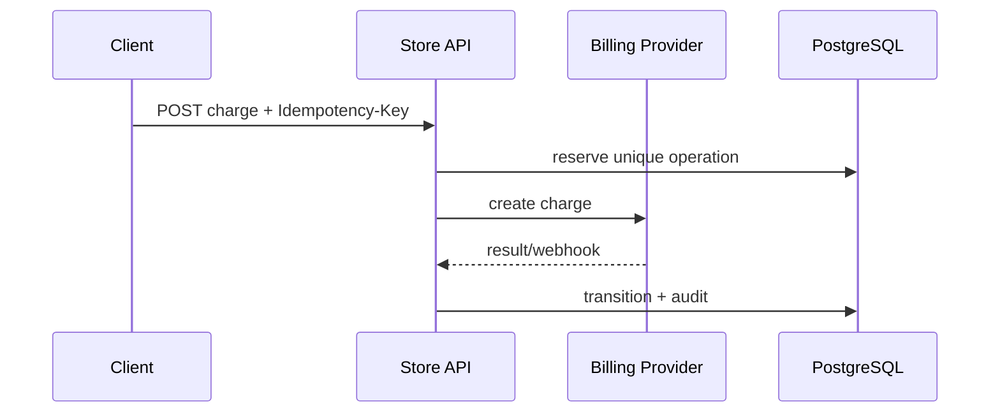

# Памятка к задаче 8: payment idempotency, concurrency и webhooks

> [!tip] В двух словах
> **Не списать дважды.** Network retry, два клика и повторный webhook должны приводить к одному логическому платежу.

## Контекст учебного примера

Магазин создаёт `OrderCharge` через внешний billing provider. Browser может повторить POST, provider — повторить webhook, а backend — упасть между внешним успехом и локальной записью.



## Ключевые термины

- **Idempotency** — повтор одной логической команды возвращает прежний результат и не создаёт вторую внешнюю операцию.
- **Concurrency** — одновременное выполнение операций, которые могут прочитать и изменить одно состояние.
- **Race condition** — результат, зависящий от того, какая конкурентная операция успела первой.
- **State machine** — набор статусов и разрешённых переходов между ними.
- **Optimistic locking** — условный update по ожидаемой версии записи; конфликт обнаруживается по нулю обновлённых строк.
- **Webhook** — входящий HTTP request от внешнего provider о произошедшем событии.
- **Raw body** — исходные bytes request до JSON parsing.
- **Request hash** — hash нормализованных значимых полей запроса, позволяющий обнаружить другое body с тем же idempotency key.
- **HMAC** — подпись сообщения общим secret, позволяющая проверить источник и целостность webhook.
- **Reconciliation** — повторная сверка локального состояния с provider после неизвестного результата.

## Почему retry опасен для POST

Клиент отправил оплату, provider её принял, но response потерялся. Клиент повторяет request. Без idempotency backend создаст второй charge.

Idempotency key связывает повторы одной операции. Backend хранит key, нормализованный request hash и результат. Тот же key + тот же request возвращает тот же payment; тот же key + другой request — конфликт.

> [!note] Аналогия для frontend
>
> - **React:** reducer разрешает менять состояние только известными actions, но локальный reducer не защищает от двух HTTP requests.
> - **Vue:** actions в Pinia также централизуют переходы UI-state, но не блокируют конкурентные backend-записи.
> - **Backend:** state machine хранится в PostgreSQL, а unique constraint и version защищают её от повторов и race conditions.

> [!note]
> Проверка `SELECT`, затем `INSERT` без unique constraint имеет race. Истина закрепляется constraint/transaction, а не только `if` в TypeScript.

## State machine

Статус — не произвольная строка. Таблица разрешённых переходов предотвращает `SUCCEEDED -> PENDING` от запоздавшего события. Transition handler один и используется API, webhook и reconciliation.

Optimistic locking добавляет `version`:

```sql
UPDATE order_charge SET status = ..., version = version + 1
WHERE id = ... AND version = expected_version;
```

Ноль обновлённых строк означает concurrent change и требует перечитать состояние.

## Webhook — внешний недоверенный request

Provider подписывает raw bytes. Если сначала распарсить и пересобрать JSON, подпись может не совпасть. Сравнение подписи делают constant-time, event ID закрепляют unique constraint.

Webhook может прийти дважды, раньше API response или не по порядку. Handler должен отвечать быстро, быть идемпотентным и не предполагать идеальную последовательность.

## Reconciliation закрывает неизвестное состояние

External operation уже успешна, но backend упал до локального commit. Нельзя просто повторить charge. Reconciliation спрашивает provider по stable ID/key и синхронизирует локальный status.

## Что нельзя хранить/логировать

Номера карт, CVV, provider secret, webhook signature и raw sensitive payload. Audit хранит IDs, переходы, result/error code и correlation ID.

## Переиспользуемый каркас

### Raw body в NestJS

Nest умеет сохранить исходные bytes рядом с parsed DTO. Опцию включают при bootstrap до подключения middleware:

```ts
const app = await NestFactory.create(AppModule, { rawBody: true });
app.useGlobalPipes(new ValidationPipe({ whitelist: true, forbidNonWhitelisted: true }));
await app.listen(3000);
```

Webhook controller получает `RawBodyRequest<Request>`; подпись проверяется до применения события:

```ts
@Post('billing/webhook')
@HttpCode(200)
async webhook(
	@Req() request: RawBodyRequest<Request>,
	@Headers('x-billing-signature') signature: string,
	@Body() event: BillingWebhookDto,
): Promise<{ received: true }> {
	if (!request.rawBody) throw new BadRequestException('Raw body is unavailable');
	verifyBillingSignature(request.rawBody, signature, this.webhookSecret);
	await this.billingEvents.apply(event);
	return { received: true };
}
```

`rawBody: true` сохраняет bytes, но не отменяет обычный JSON parsing и DTO validation. Глобальный raw parser для всех routes обычно не нужен.

Provider adapter скрывается за интерфейсом:

```ts
export interface BillingGateway {
	createCharge(input: {
		operationKey: string;
		amountMinor: number;
		currency: 'EUR';
	}): Promise<{ externalChargeId: string; status: GatewayChargeStatus }>;

	getCharge(externalChargeId: string): Promise<GatewayCharge>;
}
```

State machine держите в одном месте:

```ts
const allowed: Record<ChargeStatus, readonly ChargeStatus[]> = {
	CREATED: ['PENDING', 'FAILED', 'CANCELLED'],
	PENDING: ['SUCCEEDED', 'FAILED', 'CANCELLED'],
	SUCCEEDED: [],
	FAILED: [],
	CANCELLED: [],
};

function assertTransition(from: ChargeStatus, to: ChargeStatus) {
	if (!allowed[from].includes(to)) throw new ConflictException('Invalid payment transition');
}
```

Optimistic update защищает concurrent webhook/reconciliation:

```ts
const updated = await prisma.orderCharge.updateMany({
	where: { id, version: expectedVersion, status: expectedStatus },
	data: { status: nextStatus, version: { increment: 1 } },
});
if (updated.count === 0) throw new ConcurrentChargeUpdateError();
```

### Request hash и конфликт ключа

Hash строят только из значимых нормализованных полей в фиксированном порядке, без headers и случайных metadata:

```ts
function chargeRequestHash(dto: CreateChargeDto): string {
	const canonical = JSON.stringify({
		orderId: dto.orderId.trim(),
		amountMinor: dto.amountMinor,
		currency: dto.currency.toUpperCase(),
	});
	return createHash('sha256').update(canonical).digest('hex');
}
```

Unique key scoped to owner/store остаётся последней защитой от параллельных requests:

```ts
function isUniqueConstraintError(error: unknown): boolean {
	return error instanceof Prisma.PrismaClientKnownRequestError && error.code === 'P2002';
}

async function reserveCharge(storeId: string, key: string, dto: CreateChargeDto) {
	const requestHash = chargeRequestHash(dto);
	const existing = await prisma.orderCharge.findUnique({
		where: { storeId_idempotencyKey: { storeId, idempotencyKey: key } },
	});
	if (existing) {
		if (existing.requestHash !== requestHash) {
			throw new ConflictException('Idempotency key was used with another request');
		}
		return existing;
	}

	try {
		return await prisma.orderCharge.create({
			data: {
				storeId,
				idempotencyKey: key,
				requestHash,
				amountMinor: dto.amountMinor,
				currency: dto.currency,
				status: 'CREATED',
			},
		});
	} catch (error) {
		if (!isUniqueConstraintError(error)) throw error;
		const winner = await prisma.orderCharge.findUniqueOrThrow({
			where: { storeId_idempotencyKey: { storeId, idempotencyKey: key } },
		});
		if (winner.requestHash !== requestHash) throw new ConflictException();
		return winner;
	}
}
```

Подпись проверяется по исходным bytes:

```ts
function verifyBillingSignature(rawBody: Buffer, hexSignature: string, secret: string): void {
	const expected = createHmac('sha256', secret).update(rawBody).digest();
	const received = Buffer.from(hexSignature, 'hex');
	if (expected.length !== received.length || !timingSafeEqual(expected, received)) {
		throw new UnauthorizedException('Invalid webhook signature');
	}
}
```

Event deduplication начинается с unique insert внутри transaction:

```ts
await prisma.$transaction(async (tx) => {
	await tx.billingEvent.create({ data: { externalEventId: event.id, type: event.type } });
	await transitions.apply(tx, event);
});
```

Если insert получил unique conflict, webhook уже обработан: верните `200`, не повторяя side effects. Timeout provider означает «результат неизвестен», а не автоматический `FAILED`; такую запись подбирает reconciliation.

### Периодическая reconciliation job

Scheduler создают идемпотентно при bootstrap producer, а worker обрабатывает небольшие batches:

```ts
await billingQueue.add(
	'reconcile-pending-charges',
	{},
	{
		jobId: 'billing-reconciliation',
		repeat: { every: 5 * 60 * 1000 },
		removeOnComplete: 20,
	},
);
```

Processor выбирает старые `CREATED/PENDING`, спрашивает provider по сохранённому external ID и применяет тот же transition service, что webhook. Он не создаёт новый charge и не держит DB transaction открытой во время HTTP-вызова.

### Детерминированный fake provider

Локальный provider лучше запускать отдельным service: тогда API использует настоящий HTTP adapter и проходит timeout/webhook boundary.

```yaml
services:
  fake-billing:
    build: ./fake-billing
    command: npm run start:dev
    environment:
      WEBHOOK_URL: http://api:3000/billing/webhook
      WEBHOOK_SECRET: ${BILLING_WEBHOOK_SECRET}
    ports:
      - '3010:3010'
```

```ts
@Controller()
export class FakeBillingController {
	private readonly charges = new Map<string, FakeCharge>();

	@Post('charges')
	create(@Body() dto: FakeChargeDto) {
		const id = createHash('sha256').update(dto.operationKey).digest('hex').slice(0, 24);
		const charge = this.charges.get(id) ?? { id, status: 'PENDING', ...dto };
		this.charges.set(id, charge);
		return charge;
	}

	@Get('charges/:id')
	get(@Param('id') id: string) {
		const charge = this.charges.get(id);
		if (!charge) throw new NotFoundException();
		return charge;
	}
}
```

Для тестов fake должен уметь по явному сценарию вернуть timeout, повторить один event и прислать события не по порядку; не используйте случайность, иначе concurrency-тесты станут нестабильными.

## Частые ошибки

- idempotency только в памяти процесса;
- key глобальный без user/operation scope;
- duplicate webhook повторяет side effect;
- webhook без signature/с parsed body;
- terminal status можно откатить;
- timeout автоматически означает payment failed;
- проверять повторы только последовательно и игнорировать параллельную гонку.
