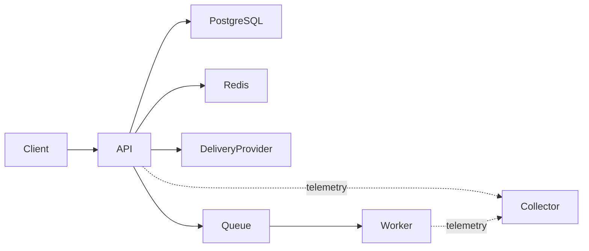

# Памятка к задаче 9: logs, traces и metrics

> [!tip] В двух словах
> **Понять сбой.** Наблюдаемость отвечает: что сломалось, у кого, где потрачено время и насколько проблема массовая.

## Контекст учебного примера

Commerce API читает PostgreSQL и Redis, вызывает delivery provider и отправляет jobs worker. Один trace должен показать весь путь, включая асинхронную границу очереди.



## Ключевые термины

- **OpenTelemetry** — общий API/SDK для создания и экспорта traces и metrics без привязки к одному observability backend.
- **Structured log** — JSON-событие с именованными полями вместо свободной строки.
- **Trace** — полный путь одной операции, а **span** — отдельный измеряемый участок этого пути.
- **Metric** — числовой временной ряд; counter считает события, histogram распределяет длительности.
- **p95 latency** — значение, быстрее которого завершились 95% операций за выбранный период.
- **Label** — ограниченное измерение metric, например route или status class.
- **Cardinality** — число уникальных сочетаний labels; IDs делают его практически неограниченным.
- **Correlation ID** — идентификатор, который можно вернуть пользователю и найти в application logs.
- **Collector** — отдельный process, принимающий telemetry и передающий её Jaeger, Prometheus или другой backend.
- **OTLP** — протокол передачи OpenTelemetry logs, traces и metrics.
- **Sampling** — сохранение только части traces для ограничения стоимости и объёма telemetry.
- **AsyncLocalStorage** — механизм Node.js для хранения context внутри одной async-цепочки.
- **Redaction** — автоматическое удаление или маскирование secrets перед записью log.

## Три сигнала

- **Logs** объясняют конкретное событие с полями контекста.
- **Metrics** показывают тенденции и позволяют alert: error rate, p95 latency, queue age.
- **Traces** связывают путь одного запроса через зависимости и workers.

Один сигнал не заменяет остальные. Миллион логов неудобен для вычисления p95, а metric не содержит stack trace конкретного падения.

> [!note] Аналогия для frontend
>
> - **React:** Context может передать request-related значение по дереву компонентов без props на каждом уровне.
> - **Vue:** `provide/inject` делает похожее для дерева Vue-компонентов.
> - **Backend:** `AsyncLocalStorage` переносит context по async-цепочке одного request, но не через очередь или другой process — туда trace context передают явно.

## Correlation ID и trace ID

Request ID удобен пользователю/support и проходит через application logs. Trace ID принадлежит distributed trace. Их полезно хранить рядом, но это разные идентификаторы.

При отправке job producer сохраняет trace context, worker извлекает его и создаёт consumer span. Иначе trace обрывается на HTTP response, хотя основная работа только началась.

## Structured JSON

Строку `failed export for user ...` трудно агрегировать. JSON с `operation`, `result`, `durationMs`, `error.type` индексируется и фильтруется.

```json
{ "level": "error", "operation": "export.upload", "result": "timeout", "traceId": "..." }
```

Не каждое поле годится в metric label. IDs создают миллионы time series и ломают monitoring backend. Высокую cardinality оставляют в logs/traces.

## Span boundaries

Span создают вокруг meaningful operation: DB query, cache lookup, queue wait/process, external API. Не нужно создавать span на каждую строку цикла. Span получает status/error и безопасные attributes, но не document content или signed URL.

## Error monitoring

Неожиданное исключение записывают один раз на boundary, группируют по типу/stack и связывают с release/environment. Клиенту возвращают стабильный error/request ID, но не внутренний stack.

## Надёжность telemetry

Telemetry экспортируется асинхронно и с лимитами. Падение collector не должно остановить оплату или login. Нужны sampling, batch export и защита от бесконечного buffer.

## Переиспользуемый NestJS-каркас

### Локальный telemetry stack

Приложения отправляют OTLP в collector; collector передаёт traces в Jaeger и публикует metrics для Prometheus:

```yaml
services:
  otel-collector:
    image: otel/opentelemetry-collector-contrib:latest
    command: ['--config=/etc/otelcol/config.yaml']
    volumes:
      - ./observability/otel-collector-config.yaml:/etc/otelcol/config.yaml:ro
    ports:
      - '4317:4317'
      - '4318:4318'
      - '13133:13133'
    healthcheck:
      test: ['CMD', '/otelcol-contrib', '--version']
      interval: 10s
      timeout: 3s
      retries: 10

  jaeger:
    image: jaegertracing/all-in-one:latest
    environment:
      COLLECTOR_OTLP_ENABLED: 'true'
    ports:
      - '16686:16686'
    healthcheck:
      test: ['CMD-SHELL', 'wget -q --spider http://localhost:16686/ || exit 1']
      interval: 10s
      timeout: 3s
      retries: 10

  prometheus:
    image: prom/prometheus:latest
    command: ['--config.file=/etc/prometheus/prometheus.yml']
    volumes:
      - ./observability/prometheus.yml:/etc/prometheus/prometheus.yml:ro
    ports:
      - '9090:9090'
    healthcheck:
      test: ['CMD-SHELL', 'wget -q --spider http://localhost:9090/-/ready || exit 1']
      interval: 10s
      timeout: 3s
      retries: 10
```

В рабочем проекте tags фиксируют на проверенных версиях. Минимальный collector config:

```yaml
receivers:
  otlp:
    protocols:
      grpc:
        endpoint: 0.0.0.0:4317
      http:
        endpoint: 0.0.0.0:4318

exporters:
  otlp/jaeger:
    endpoint: jaeger:4317
    tls:
      insecure: true
  prometheus:
    endpoint: 0.0.0.0:9464

extensions:
  health_check:
    endpoint: 0.0.0.0:13133

service:
  extensions: [health_check]
  pipelines:
    traces:
      receivers: [otlp]
      exporters: [otlp/jaeger]
    metrics:
      receivers: [otlp]
      exporters: [prometheus]
```

Prometheus забирает metrics с collector:

```yaml
global:
  scrape_interval: 15s

scrape_configs:
  - job_name: otel-collector
    static_configs:
      - targets: ['otel-collector:9464']
```

Instrumentation загружается до Nest modules:

```ts
// instrumentation.ts — импортировать первой строкой API и worker entry points
const sdk = new NodeSDK({
	traceExporter: new OTLPTraceExporter({
		url: process.env.OTEL_EXPORTER_OTLP_ENDPOINT,
	}),
	metricReader: new PeriodicExportingMetricReader({
		exporter: new OTLPMetricExporter({
			url: process.env.OTEL_EXPORTER_OTLP_METRICS_ENDPOINT,
		}),
		exportIntervalMillis: 15_000,
	}),
	instrumentations: [getNodeAutoInstrumentations()],
});

void sdk.start();
```

API и worker должны импортировать `./instrumentation` **до** `AppModule`/`WorkerModule`; иначе часть библиотек загрузится раньше auto-instrumentation. На shutdown вызывают `sdk.shutdown()` с ограниченным timeout.

Async context service позволяет не передавать request ID во все методы:

```ts
type OperationContext = { requestId: string; customerId?: string; storeId?: string };

@Injectable()
export class OperationContextService {
	private readonly storage = new AsyncLocalStorage<OperationContext>();

	run<T>(value: OperationContext, callback: () => T): T {
		return this.storage.run(value, callback);
	}

	get(): OperationContext | undefined {
		return this.storage.getStore();
	}
}
```

Logger добавляет trace IDs, но redacts secrets:

```ts
@Module({
	imports: [
		LoggerModule.forRoot({
			pinoHttp: {
				customProps: () => {
					const span = trace.getActiveSpan()?.spanContext();
					return span ? { traceId: span.traceId, spanId: span.spanId } : {};
				},
				redact: [
					'req.headers.authorization',
					'req.body.password',
					'req.body.passwordConfirmation',
					'res.headers["set-cookie"]',
					'presignedUrl',
					'webhookSignature',
				],
			},
		}),
	],
})
export class LoggingModule {}
```

Middleware оформляют как `NestMiddleware` и подключают для всех routes:

```ts
@Injectable()
export class RequestContextMiddleware implements NestMiddleware {
	constructor(private readonly context: OperationContextService) {}

	use(request: Request, response: Response, next: NextFunction) {
		const incoming = request.header('x-request-id');
		const requestId = isSafeRequestId(incoming) ? incoming! : randomUUID();
		response.setHeader('x-request-id', requestId);
		this.context.run({ requestId }, next);
	}
}

export class AppModule implements NestModule {
	configure(consumer: MiddlewareConsumer) {
		consumer.apply(RequestContextMiddleware).forRoutes('*');
	}
}
```

Global exception filter пишет неожиданное исключение один раз вместе с request/trace IDs и возвращает клиенту безопасный response. Ожидаемые `4xx` не отправляют как server error:

```ts
@Catch()
export class UnhandledExceptionFilter implements ExceptionFilter {
	catch(error: unknown, host: ArgumentsHost) {
		const response = host.switchToHttp().getResponse<Response>();
		const status = error instanceof HttpException ? error.getStatus() : 500;
		if (status >= 500) this.logger.error({ err: error }, 'Unhandled request error');
		response.status(status).json({ statusCode: status, requestId: this.context.get()?.requestId });
	}
}
```

Trace context передаётся через очередь стандартными W3C headers:

```ts
const carrier: Record<string, string> = {};
propagation.inject(context.active(), carrier);
await queue.add('job', { entityId, traceContext: carrier });

const parent = propagation.extract(context.active(), job.data.traceContext);
await context.with(parent, () => tracer.startActiveSpan('job.process', processJob));
```

Ручной span полезен вокруг операции, для которой нет надёжной auto-instrumentation:

```ts
return tracer.startActiveSpan('catalog.item.load', async (span) => {
	try {
		span.setAttribute('db.system', 'postgresql');
		return await prisma.item.findUniqueOrThrow({ where: { id: itemId } });
	} catch (error) {
		span.recordException(error as Error);
		span.setStatus({ code: SpanStatusCode.ERROR });
		throw error;
	} finally {
		span.end();
	}
});
```

Для Prisma сначала рассмотрите официальную instrumentation (`@prisma/instrumentation`), чтобы не оборачивать каждый query вручную. В attributes не добавляют SQL parameters, entity IDs или текст документов.

Metric labels должны быть ограничены: `{ method: 'GET', route: '/notes/:id', status: '2xx' }`. ID пользователя или raw URL оставляйте в trace/log.

Для duration нужна histogram, а для количества операций — counter:

```ts
const requestDuration = meter.createHistogram('http.server.duration', { unit: 'ms' });
const requestCount = meter.createCounter('http.server.requests');

const labels = { method: 'GET', route: '/notes/:id', status: '2xx' };
requestDuration.record(durationMs, labels);
requestCount.add(1, labels);
```

Route должен быть шаблоном, а не raw URL: `/notes/42` и `/notes/99` обязаны попасть в одну time series.

## Частые ошибки

- логировать Authorization header;
- raw URL/entityId как metric label;
- новый request ID на каждом service call;
- trace теряется в queue;
- `console.log` рядом со structured logger;
- считать каждый ожидаемый `404` server error;
- telemetry backend становится обязательной зависимостью API.
