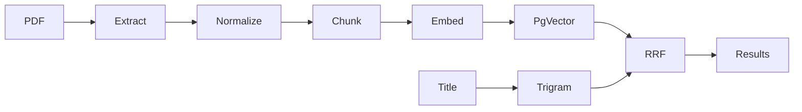

# Памятка к задаче 10: pipelines, embeddings и hybrid search

> [!tip] В двух словах
> **Повторяемая обработка.** Versioning и идемпотентные stages позволяют пережить сбой, а hybrid search сочетает точные слова и смысл.

## Контекст учебного примера

Исследовательская библиотека принимает PDF статьи `Paper`, создаёт `PaperVersion`, извлекает текст и индексирует chunks. Поиск объединяет совпадения заголовков и смысловую близость.



## Ключевые термины

- **Ingest** — приём исходного файла и создание новой версии обработки.
- **Pipeline stage** — отдельный повторяемый шаг обработки с собственным состоянием.
- **Checkpoint** — сохранённый результат стадии, позволяющий продолжить pipeline после сбоя.
- **Chunk** — ограниченный фрагмент текста; **overlap** повторяет часть границы соседних chunks.
- **Token** — единица текста модели, не обязательно совпадающая со словом или символом.
- **Embedding** — числовой vector текста; **dimension** — количество чисел в этом vector.
- **Semantic search** ищет по смыслу, а **lexical/trigram search** — по словам и символам.
- **Top-K** — первые K результатов после ranking.
- **HNSW** — приближённый индекс pgvector для быстрого поиска ближайших vectors.
- **Cosine distance** — мера различия направлений двух vectors; меньшее значение означает большую семантическую близость.
- **Rate limit** — ограничение числа запросов к provider за промежуток времени.
- **RRF** — объединение нескольких ranked lists по позициям результатов, а не по несовместимым raw scores.

## Почему pipeline разбивают на стадии

Извлечение текста, нормализация, chunking и embeddings имеют разную стоимость и причины ошибок. Один огромный worker приходится начинать сначала. Отдельные stages сохраняют checkpoint и повторяют только незавершённую часть.

```text
file -> extract -> normalize -> chunks -> embeddings -> index -> active
```

Каждая стадия имеет immutable input/version и идемпотентный key. Duplicate message тогда возвращает уже созданный result.

> [!note] Аналогия для frontend
>
> - **React:** многошаговый upload flow можно хранить как state machine, но перезагрузка вкладки уничтожит несохранённое локальное состояние.
> - **Vue:** composable или Pinia store также описывает стадии UI, но сам по себе не переживает падение server process.
> - **Backend:** pipeline сохраняет version, stage и checkpoint в PostgreSQL, поэтому другой worker может безопасно продолжить обработку.

## Versioning защищает текущий документ

Новая загрузка может не распарситься или AI provider может быть недоступен. Если сразу заменить current content, поиск потеряет рабочую версию. Поэтому новая version строится рядом и становится active атомарно только после полного index.

`pipelineVersion` фиксирует алгоритм normalization/chunking. Одинаковый файл, обработанный другим алгоритмом, не считается тем же результатом.

## Что такое embedding

Embedding — числовой вектор, в котором семантически похожие тексты располагаются ближе. Query и chunks должны быть созданы совместимой моделью и dimension. Смешивать vectors разных моделей в одном сравнении нельзя.

Документ делят на chunks, потому что модель имеет input limit, а маленький relevant fragment ранжируется лучше целой книги. Overlap сохраняет мысль на границе chunks, но увеличивает стоимость и дубли.

## Почему hybrid лучше одного поиска

Trigram хорошо находит точное имя, код и опечатку. Semantic search — перефразированную мысль. Reciprocal Rank Fusion объединяет позиции без попытки сравнить несопоставимые raw scores.

```text
RRF score = sum(1 / (k + rank_in_list))
```

## Permissions применяются до top-K

Фильтрация после vector `LIMIT 20` может удалить почти все результаты и уже допустит retrieval чужих chunks. Predicate доступной библиотеки должен быть внутри vector и lexical queries до ranking limit.

## Миграция модели

Новая embedding model меняет vectors и часто dimension. Production rollout повторяет database migration pattern: versioned storage, dual-write, rate-limited backfill, quality/coverage check, config switch, rollback window, cleanup.

## Отказоустойчивость AI вызовов

429 требует уважать Retry-After/backoff. Batch получает stable IDs; частичный успех сохраняется, чтобы не оплачивать всё повторно. Cost metrics считают tokens/chunks без логирования текста.

## Переиспользуемые алгоритмы

AI provider закрывается интерфейсом:

```ts
export interface Vectorizer {
	vectorizePassages(passages: string[]): Promise<number[][]>;
	vectorizeQuestion(question: string): Promise<number[]>;
}
```

Для production adapter Voyage AI получает passages и query разными методами API, а название модели и её dimension фиксируются вместе с `embeddingVersion`. Ответ provider — обычный JSON с vectors; его нельзя смешивать с vectors другой модели или dimension.

REST adapter вызывает один endpoint, но различает corpus и search query через `input_type`. Актуальный контракт сверяют с [официальной документацией Voyage embeddings](https://docs.voyageai.com/docs/embeddings):

```ts
import { setTimeout } from 'node:timers/promises';

type VoyageResponse = {
	data: Array<{ embedding: number[]; index: number }>;
};

function retryDelayMs(header: string | null, attempt: number): number {
	if (header) {
		const seconds = Number(header);
		if (Number.isFinite(seconds)) return Math.min(60_000, Math.max(0, seconds * 1000));
		const date = Date.parse(header);
		if (Number.isFinite(date)) return Math.min(60_000, Math.max(0, date - Date.now()));
	}
	const exponential = Math.min(30_000, 500 * 2 ** (attempt - 1));
	return exponential + Math.floor(Math.random() * 250);
}

export class VoyageVectorizer implements Vectorizer {
	constructor(
		private readonly apiKey: string,
		private readonly model: string,
		private readonly dimension: number,
		private readonly fetchImpl: typeof fetch = fetch,
	) {}

	vectorizePassages(passages: string[]): Promise<number[][]> {
		return this.embed(passages, 'document');
	}

	async vectorizeQuestion(question: string): Promise<number[]> {
		return (await this.embed([question], 'query'))[0];
	}

	private async embed(input: string[], inputType: 'document' | 'query'): Promise<number[][]> {
		for (let attempt = 1; attempt <= 4; attempt += 1) {
			const response = await this.fetchImpl('https://api.voyageai.com/v1/embeddings', {
				method: 'POST',
				headers: {
					authorization: `Bearer ${this.apiKey}`,
					'content-type': 'application/json',
				},
				body: JSON.stringify({ input, model: this.model, input_type: inputType }),
			});

			if (response.status === 429 || response.status >= 500) {
				if (attempt === 4) throw new Error(`Voyage temporary error: ${response.status}`);
				await setTimeout(retryDelayMs(response.headers.get('retry-after'), attempt));
				continue;
			}
			if (!response.ok) throw new Error(`Voyage request rejected: ${response.status}`);

			const body = (await response.json()) as VoyageResponse;
			const vectors = body.data
				.toSorted((left, right) => left.index - right.index)
				.map((item) => item.embedding);
			if (
				vectors.length !== input.length ||
				vectors.some((item) => item.length !== this.dimension)
			) {
				throw new Error('Unexpected embedding response shape');
			}
			return vectors;
		}
		throw new Error('Unreachable');
	}
}
```

`retryDelayMs` сначала уважает `Retry-After` (seconds или HTTP date), иначе возвращает exponential backoff с jitter. Batch ограничивают одновременно по числу inputs и token budget provider; API key никогда не попадает в job payload или logs.

Детерминированный fake позволяет прогнать pipeline без сети и стоимости:

```ts
export class FakeVectorizer implements Vectorizer {
	constructor(private readonly dimension: number) {}

	vectorizePassages(passages: string[]): Promise<number[][]> {
		return Promise.resolve(passages.map((value) => this.vector(value)));
	}

	vectorizeQuestion(question: string): Promise<number[]> {
		return Promise.resolve(this.vector(question));
	}

	private vector(value: string): number[] {
		const digest = createHash('sha256').update(value.normalize('NFKC')).digest();
		return Array.from(
			{ length: this.dimension },
			(_, index) => (digest[index % digest.length] - 127.5) / 127.5,
		);
	}
}
```

В queue передаются только IDs и hashes:

```ts
type PaperPipelineMessage = {
	paperVersionId: string;
	stage: 'EXTRACT' | 'NORMALIZE' | 'SPLIT' | 'VECTORIZE' | 'INDEX';
	inputHash: string;
	traceContext?: Record<string, string>;
};
```

### Prisma и `pgvector`

Prisma Client не предоставляет обычный scalar для `vector`. Поле отмечают как `Unsupported`, поэтому insert/search выполняют параметризованным raw SQL:

```prisma
model PassageEmbedding {
  id               String                     @id @default(uuid())
  passageId        String
  embeddingVersion String
  model             String
  embedding         Unsupported("vector(1024)")
  passage           Passage                    @relation(fields: [passageId], references: [id])

  @@unique([passageId, embeddingVersion])
}
```

Extension, vector column и HNSW оформляют custom Prisma migration:

```bash
npx prisma migrate dev --create-only --name add-passage-embeddings
# отредактировать и проверить migration.sql
npx prisma migrate dev
npx prisma generate
```

Пример ручной части migration для модели с dimension 1024:

```sql
CREATE EXTENSION IF NOT EXISTS vector;

CREATE TABLE "PassageEmbedding" (
  "id" TEXT NOT NULL,
  "passageId" TEXT NOT NULL,
  "embeddingVersion" TEXT NOT NULL,
  "model" TEXT NOT NULL,
  "embedding" vector(1024) NOT NULL,
  CONSTRAINT "PassageEmbedding_pkey" PRIMARY KEY ("id"),
  CONSTRAINT "PassageEmbedding_passageId_fkey"
    FOREIGN KEY ("passageId") REFERENCES "Passage"("id")
    ON DELETE CASCADE ON UPDATE CASCADE
);

CREATE UNIQUE INDEX "PassageEmbedding_passageId_embeddingVersion_key"
ON "PassageEmbedding"("passageId", "embeddingVersion");

CREATE INDEX "PassageEmbedding_embedding_hnsw_idx"
ON "PassageEmbedding"
USING hnsw ("embedding" vector_cosine_ops);
```

Не копируйте этот SQL поверх уже сгенерированного `CREATE TABLE`: объедините их в одну итоговую версию без повторяющихся колонок/indexes. `CREATE EXTENSION` должен стоять до первого использования типа `vector`. Всегда просматривайте итоговый `migration.sql`; применённую migration не переписывают и `db push` вместо неё не используют.

Raw insert валидирует dimension/finite values и передаёт vector как параметр, а не через конкатенацию SQL:

```ts
function vectorLiteral(values: number[], dimension: number): string {
	if (values.length !== dimension || values.some((value) => !Number.isFinite(value))) {
		throw new Error('Invalid embedding');
	}
	return `[${values.join(',')}]`;
}

const literal = vectorLiteral(embedding, 1024);
await prisma.$executeRaw`
	INSERT INTO "PassageEmbedding"
		("id", "passageId", "embeddingVersion", "model", "embedding")
	VALUES
		(${randomUUID()}, ${passageId}, ${embeddingVersion}, ${model}, ${literal}::vector)
	ON CONFLICT ("passageId", "embeddingVersion")
	DO UPDATE SET "model" = EXCLUDED."model", "embedding" = EXCLUDED."embedding"
`;
```

Chunk text и vector полезно хранить в разных таблицах: переиндексация embeddings тогда не дублирует текст. Permission predicate и current-version filter входят в vector query до `LIMIT`:

```ts
const queryLiteral = vectorLiteral(queryEmbedding, 1024);
const hits = await prisma.$queryRaw<SemanticHit[]>`
	SELECT
		pe."passageId",
		p."id" AS "paperId",
		pe."embedding" <=> ${queryLiteral}::vector AS distance
	FROM "PassageEmbedding" pe
	JOIN "Passage" passage ON passage."id" = pe."passageId"
	JOIN "PaperVersion" pv ON pv."id" = passage."paperVersionId"
	JOIN "Paper" p ON p."id" = pv."paperId"
	JOIN "LibraryMember" lm ON lm."libraryId" = p."libraryId"
	WHERE lm."userId" = ${userId}
		AND p."currentVersionId" = pv."id"
		AND pe."embeddingVersion" = ${embeddingVersion}
	ORDER BY pe."embedding" <=> ${queryLiteral}::vector ASC
	LIMIT ${limit}
`;
```

Здесь `<=>` вычисляет cosine distance: меньшее значение означает более близкий vector. Relation path проходит `PassageEmbedding -> Passage -> PaperVersion -> Paper -> LibraryMember`, а current-version predicate исключает старый, но ещё не удалённый index. Если сначала взять global top-K и только потом удалить чужие papers, выдача станет одновременно небезопасной и неполной.

Простой chunker с overlap показывает идею; production token count должен использовать tokenizer выбранной модели:

```ts
function chunk<T>(tokens: T[], size = 800, overlap = 100): T[][] {
	if (overlap >= size) throw new Error('overlap must be smaller than size');
	const result: T[][] = [];
	for (let start = 0; start < tokens.length; start += size - overlap) {
		result.push(tokens.slice(start, start + size));
		if (start + size >= tokens.length) break;
	}
	return result;
}
```

RRF объединяет lexical и semantic ranks, не сравнивая их raw scores:

```ts
function reciprocalRankFusion(lists: PaperHit[][], k = 60): PaperHit[] {
	const scores = new Map<string, number>();
	const hits = new Map<string, PaperHit>();

	for (const list of lists) {
		list.forEach((hit, index) => {
			hits.set(hit.paperId, hit);
			scores.set(hit.paperId, (scores.get(hit.paperId) ?? 0) + 1 / (k + index + 1));
		});
	}

	return [...hits.values()].sort((a, b) => scores.get(b.paperId)! - scores.get(a.paperId)!);
}
```

Stage processing начинается с unique claim `(versionId, stage, inputHash)`. Текст и vectors загружаются по ID, не передаются в broker payload. Vector query обязательно содержит tenant predicate до `ORDER BY vector <=> query LIMIT n`.

При смене модели храните рядом `model`, `dimension`, `embeddingVersion` и coverage. Config switch меняет read version только после backfill/quality check; предыдущая version остаётся для rollback.

## Частые ошибки

- current version переключается до окончания index;
- stage не проверяет prerequisite;
- vectors без model/version metadata;
- retry всего batch после одного failed item;
- semantic candidates фильтруются в JavaScript;
- chunks/document content попадают в logs;
- качество оценивается только субъективным одним запросом.
